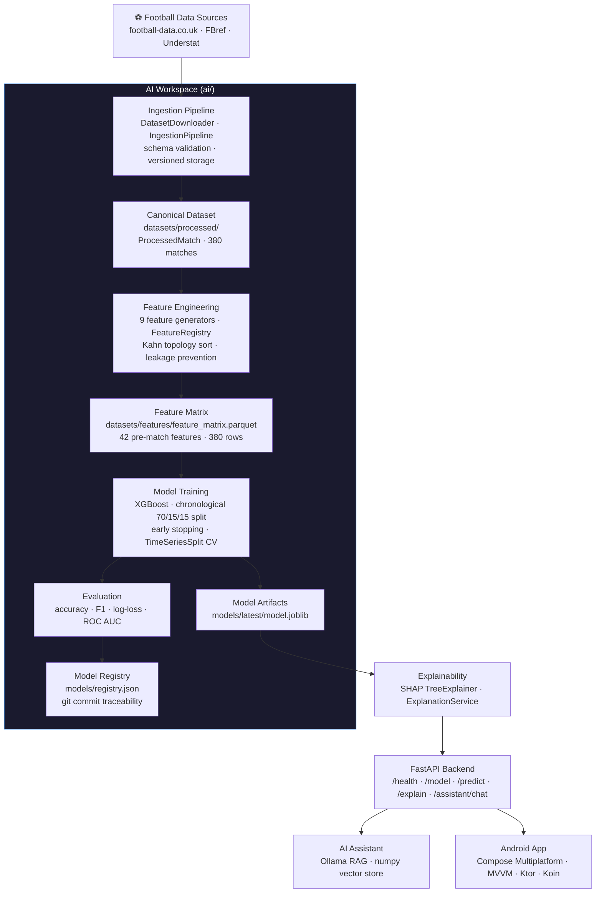
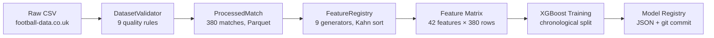
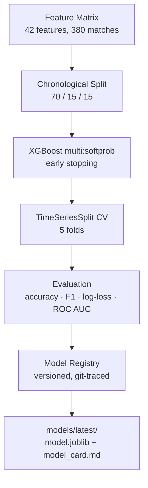
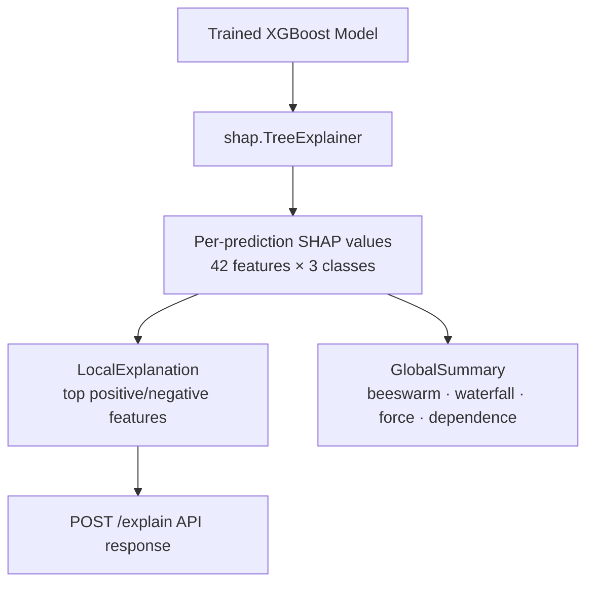
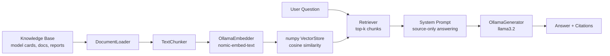
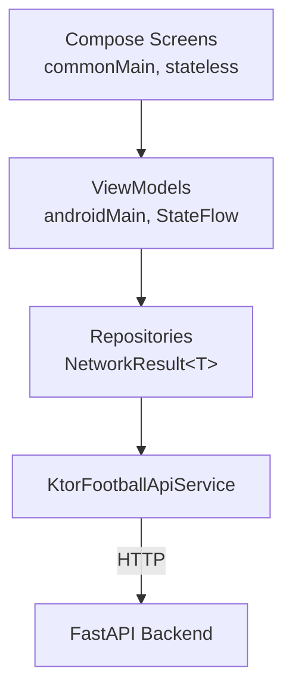

# Football Intelligence Platform

**An AI-first football analytics platform — from raw match data to an explainable, grounded, mobile-native prediction experience.**

[](.github/workflows) [](docs/reports/) [](LICENSE) [](ai/pyproject.toml) [](frontend/)

---

## Project Overview

The Football Intelligence Platform ingests structured Premier League match data, trains an XGBoost model to predict match outcomes, explains every prediction with SHAP, and surfaces those insights through a retrieval-augmented AI assistant and a native Android client.

It is a complete, working system — not a notebook or a prototype. Twelve build stages take it from an empty repository to a tested, documented, end-to-end product: ingestion → validation → feature engineering → model training → explainability → a FastAPI backend → a locally-grounded RAG assistant → a Compose Multiplatform Android app → full integration testing.

**462 tests pass. Every prediction carries a SHAP explanation. The assistant never invents facts.**

---

## Why This Project Exists

Most ML portfolio projects stop at a Jupyter notebook with an accuracy score. This one was built to answer a harder question: **what does it take to ship a model as a real, usable, explainable product?**

That means:

- A model that doesn't just predict — it explains *why*, on every single request, via SHAP.
- An AI assistant that doesn't hallucinate — every answer is grounded in retrieved data with citations, or it says it doesn't know.
- A mobile client that talks to real infrastructure, not mock data — the same FastAPI backend, the same model, the same explanations.
- A pipeline that is reproducible from a single command, with no manual notebook steps and no cloud dependency.
- Engineering discipline applied throughout: typed code, 80%+ test coverage, ADRs for every structural decision, and a clean layered architecture in both the Python and Kotlin codebases.

This project demonstrates AI engineering as a discipline: not just "can I train a model," but "can I build, explain, serve, test, and ship one."

---

## Key Capabilities

| Capability | Description |
|---|---|
| **Match outcome prediction** | XGBoost classifier predicting Home Win / Draw / Away Win with calibrated probabilities |
| **Per-prediction explainability** | SHAP `TreeExplainer` attaches feature-level attribution to every single prediction — no black box |
| **Grounded AI assistant** | Local RAG pipeline (Ollama + numpy vector store) answers football questions using only retrieved platform data, with source citations |
| **Production-shaped backend** | FastAPI with 5 REST endpoints, structured error handling, OpenAPI docs, lifespan dependency injection |
| **Native Android client** | 8-screen Compose Multiplatform app, MVVM, StateFlow, Koin DI — consumes the real backend |
| **Full reproducibility** | Entire pipeline (ingest → features → train → explain) runs in under 15 seconds from one CLI command |
| **End-to-end test coverage** | 462 tests: unit tests across every Python package, integration tests against the real model, Android repository tests |
| **Zero cloud dependency** | Runs entirely on a laptop — no managed database, no cloud LLM, no hosted vector store |

---

## Architecture Diagram



---

## Technology Stack

| Layer | Technologies |
|---|---|
| **ML / Data** | Python 3.12, XGBoost 3.0, scikit-learn 1.9, pandas, NumPy, PyArrow |
| **Explainability** | SHAP 0.46 (`TreeExplainer`), Matplotlib |
| **AI Assistant** | Ollama (`llama3.2`, `nomic-embed-text`), numpy vector store, custom RAG pipeline |
| **Backend** | FastAPI, Pydantic v2, `pydantic-settings`, uvicorn |
| **Mobile** | Kotlin, Compose Multiplatform, Ktor client, Koin DI, AndroidX Navigation Compose, Material 3 |
| **Tooling** | uv (Python dependency management), Gradle 8.8, Ruff, Black, MyPy, Detekt, Spotless |
| **Testing** | pytest (462 tests), JUnit 5, MockK, Turbine |
| **CI/CD** | GitHub Actions |

---

## Repository Structure

```
.github/            # CI workflows, issue templates, PR template, CODEOWNERS
.claude/            # AI agent project instructions (architecture rules, coding standards)
docs/               # ADRs, stage reports, demo guides, release notes, showcase docs
playbook/           # Prompt templates and retrieval configs (version-controlled, tested)
frontend/           # Compose Multiplatform Android application (13 Gradle modules)
backend/            # (legacy scaffold — active backend lives in ai/backend/)
ai/                 # Python workspace: ingestion → features → training → explainability → RAG → API
datasets/           # Raw, processed, and feature-engineered football data (versioned)
models/             # Trained model artifacts, registry, evaluation reports
scripts/            # Setup and automation scripts
tools/              # Shared CLI utilities
```

---

## AI Pipeline Overview

The `ai/` workspace is a single Python project (managed with [uv](https://github.com/astral-sh/uv)) that owns the entire ML lifecycle:



Every transformation is a reproducible script — never a notebook. Raw data is immutable; nothing downstream ever overwrites a source file.

## Application Architecture

The system follows Clean Architecture with strict, one-directional layer dependencies:

| Layer | Responsibility |
|---|---|
| Domain | Entities, value objects, business rules |
| Application | Use cases, service interfaces, DTOs |
| Infrastructure | Database, external APIs, file I/O, ML models |
| Presentation | FastAPI routes, Compose UI, ViewModels |

The AI layer is decoupled from the backend — the backend calls into AI services through a clean interface and never touches model internals directly. The Android frontend uses MVVM: ViewModels own state as `StateFlow`; Composables are pure functions of state.

## Model Training Pipeline



The 70/15/15 split is chronological, not random — see [ADR 003](docs/adr/003-chronological-train-val-test-split.md) for why this matters for a time-series prediction problem. Result: **56.1% test accuracy, 0.625 ROC AUC (OvR)** on a 3-class problem (random baseline: 33.3%).

## Explainability Pipeline



Every prediction is explainable — not as an afterthought, but as a first-class API response. See [ADR 004](docs/adr/004-shap-for-explainability.md) for why SHAP was chosen over LIME, native XGBoost importance, and Captum.

## Football Intelligence Assistant



The assistant is instructed, by system prompt, to answer **only** from retrieved context. Low-relevance chunks are filtered before generation. If Ollama isn't running, the backend degrades gracefully — `POST /assistant/chat` returns `503`, never a crash.

## Android Application



8 screens (Home, Match Prediction, Prediction Result, Explain Prediction, AI Assistant Chat, Model Information, Settings, About), all backed by `StateFlow<UiState>` ViewModels and Koin dependency injection. See [frontend/README.md](frontend/README.md) for the full module graph.

## Backend Services

FastAPI exposes five REST endpoints, all documented automatically via OpenAPI:

| Endpoint | Method | Purpose |
|---|---|---|
| `/health` | GET | Service + model availability status |
| `/model` | GET | Model version, training metadata, evaluation metrics |
| `/predict` | POST | Match outcome prediction with probabilities |
| `/explain` | POST | Prediction + full SHAP feature attribution |
| `/assistant/chat` | POST | RAG-grounded football Q&A |

Dependency injection happens once at FastAPI lifespan startup — no global state, no per-request model reloads. Structured errors: `503` (service unavailable), `422` (validation), `500` (unexpected, logged).

---

## Screenshots

See [docs/showcase/screenshots/README.md](docs/showcase/screenshots/README.md) for the screenshot capture checklist (Home, Prediction, Explainability, Assistant, Model Info, Architecture, API docs).

## Demo Video

A recorded walkthrough is not yet linked here. See [docs/showcase/demo-script.md](docs/showcase/demo-script.md) for ready-to-run 5/10/20-minute demo scripts that can be used to record one.

---

## Quick Start

### Running the AI Pipeline

```sh
cd ai
uv sync --extra dev

uv run python -m scripts.ingest_football_data
uv run python -m feature_engineering.pipeline
uv run python -m training.pipeline
uv run python -m explainability.pipeline
```

### Running the Backend

```sh
cd ai
uv run uvicorn backend.app.main:app --reload
```

Visit `http://127.0.0.1:8000/docs` for interactive OpenAPI documentation.

To enable the AI assistant (optional, requires [Ollama](https://ollama.com)):

```sh
ollama pull nomic-embed-text
ollama pull llama3.2
uv run python -m assistant.pipeline --rebuild
```

### Running Android

```sh
cd frontend
./gradlew assembleDebug
adb install app/build/outputs/apk/debug/app-debug.apk
```

The app targets `http://10.0.2.2:8000` (the Android emulator's alias for the host machine's localhost).

### Running Tests

```sh
# Python: unit + integration (462 tests)
cd ai && uv run pytest

# Python: unit tests only
uv run pytest -m "not integration"

# Android
cd frontend && ./gradlew test
```

---

## Project Documentation

| Document | Purpose |
|---|---|
| [Documentation Index](docs/README.md) | Full documentation map |
| [ADR Index](docs/adr/README.md) | All architectural decision records |
| [Stage Reports](docs/reports/) | Detailed report for every build stage (1–12) |
| [Demo Scripts](docs/demo/README.md) | Per-stage manual verification guides |
| [CLI Reference](docs/reference/cli.md) | All pipeline commands |
| [Quick Start Guide](docs/setup/quick-start.md) | Fastest path to a running system |
| [Troubleshooting](docs/troubleshooting.md) | Common issues and fixes |
| [AI Layer](ai/README.md) | Python workspace structure |
| [Backend](backend/README.md) | Backend service notes |
| [Frontend](frontend/README.md) | Android module structure |
| [Model Card](models/latest/model_card.md) | Trained model details |
| [Project Showcase](docs/showcase/project-showcase.md) | Full technical write-up for this project |
| [Portfolio Summary](docs/showcase/portfolio-summary.md) | Two-page recruiter-facing summary |
| [Interview Guide](docs/showcase/interview-guide.md) | 50 likely interview questions with answers |

---

## Architecture Decision Records

| ADR | Title | Status |
|---|---|---|
| [001](docs/adr/001-use-xgboost-for-predictions.md) | Use XGBoost for match outcome prediction | Accepted |
| [002](docs/adr/002-joblib-model-serialization.md) | Use joblib for model serialisation | Accepted |
| [003](docs/adr/003-chronological-train-val-test-split.md) | Use chronological train/validation/test split | Accepted |
| [004](docs/adr/004-shap-for-explainability.md) | Use SHAP TreeExplainer for model explainability | Accepted |

---

## Release History

| Version | Date | Highlights |
|---|---|---|
| [v1.0.0](docs/releases/v1.0.0.md) | 2026-07-01 | Android app, end-to-end integration tests, performance benchmarks, production readiness |
| [v0.2.0](docs/releases/v0.2.0.md) | 2026-06-30 | SHAP explainability, FastAPI backend, RAG assistant |
| [v0.1.0](docs/releases/v0.1.0.md) | — | Data pipeline, feature engineering, XGBoost training |

---

## Roadmap

| Stage | Name | Status |
|---|---|---|
| 1 | Repository Foundation | ✅ Complete |
| 2 | Compose Foundation | ✅ Complete |
| 3 | AI Workspace | ✅ Complete |
| 4 | Data Acquisition Framework | ✅ Complete |
| 5 | Real Dataset Ingestion | ✅ Complete |
| 6 | Feature Engineering | ✅ Complete |
| 7 | Model Training & Evaluation | ✅ Complete |
| 8 | Explainable AI | ✅ Complete |
| 9 | Backend API | ✅ Complete |
| 10 | Football Intelligence Assistant | ✅ Complete |
| 11 | Android Application | ✅ Complete |
| 12 | Integration & Production Readiness | ✅ Complete |

**v1.0.0 marks the completion of the planned scope.** See [Future Improvements](#future-improvements-out-of-scope) for ideas beyond it.

---

## Lessons Learned

- **Chronological splits matter more than they seem.** An early random train/test split looked fine until cross-validation exposed leakage from future match outcomes into rolling-form features. Switching to a strict chronological split (ADR 003) and `.shift(1)` on every rolling feature fixed it — see [docs/adr/003-chronological-train-val-test-split.md](docs/adr/003-chronological-train-val-test-split.md).
- **Explainability is a product feature, not a debugging tool.** Building `POST /explain` as a first-class endpoint (not a notebook cell) forced the SHAP pipeline to be fast, deterministic, and API-shaped — which made it directly usable from the Android client.
- **Grounding is mostly a prompting and retrieval-quality problem, not a model-size problem.** A small local model (`llama3.2`) with a tight, source-only system prompt and relevance-filtered retrieval produced more trustworthy answers than a larger model with loose grounding.
- **KMP module boundaries pay for themselves.** Splitting `core-network`, `core-model`, and `feature-*` modules early made it possible to write Ktor repository tests without spinning up Android instrumentation at all.
- **Integration tests against the real model catch what mocks can't.** Stage 12's 36 integration tests (using the actual `model.joblib`, not mocks) caught latency characteristics and SHAP attribution-sign issues that the 426 mocked unit tests could not.

---

## Future Improvements (Out of Scope)

These are explicitly **not** implemented and are not planned within this project's scope. They are listed for transparency:

- Multi-season dataset ingestion with cross-season Elo persistence (currently resets per pipeline run).
- Hyperparameter optimisation (Optuna or similar) — current model uses fixed XGBoost hyperparameters.
- Structured RAG faithfulness evaluation against a ground-truth Q&A set.
- Android on-device feature computation from real match context (currently uses neutral demo feature values — see [`buildNeutralFeatures()`](frontend/core-model/src/commonMain/kotlin/com/footballintelligence/core/model/Team.kt)).
- Authentication, rate limiting, or any change required for public deployment.
- PostgreSQL backend for production use (SQLite/file-based artifacts are sufficient for this project's scope).
- Fine-tuning or LoRA training of any language model — deliberately out of scope per the project's AI philosophy.

---

## License

MIT License. See [LICENSE](LICENSE).

## Acknowledgements

- [football-data.co.uk](https://www.football-data.co.uk/) for the Premier League 2023/24 match data.
- [Ollama](https://ollama.com) for local LLM serving (`llama3.2`, `nomic-embed-text`).
- [SHAP](https://github.com/shap/shap) for the `TreeExplainer` implementation underpinning all explainability features.
- [XGBoost](https://xgboost.readthedocs.io/), [JetBrains Compose Multiplatform](https://www.jetbrains.com/lp/compose-multiplatform/), and [FastAPI](https://fastapi.tiangolo.com/) as the core frameworks this project is built on.
