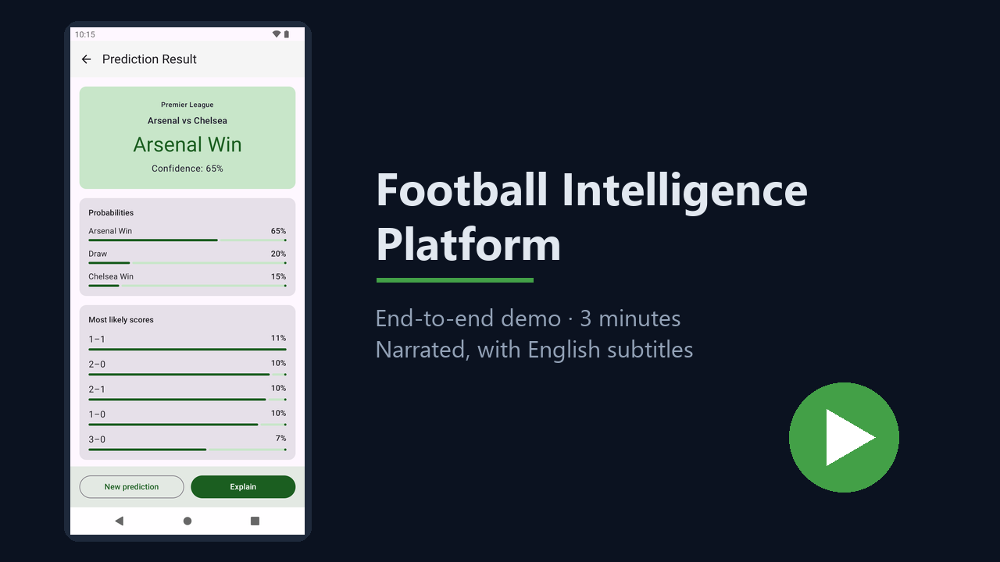
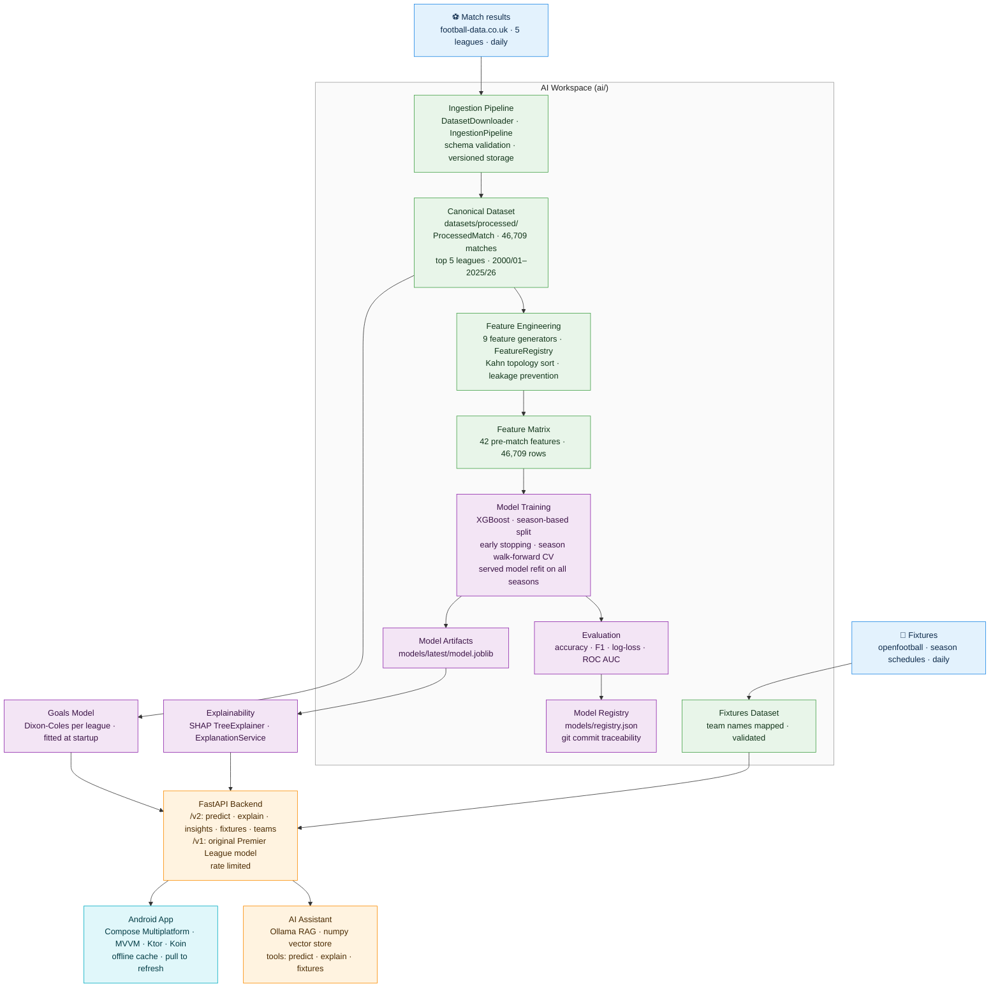
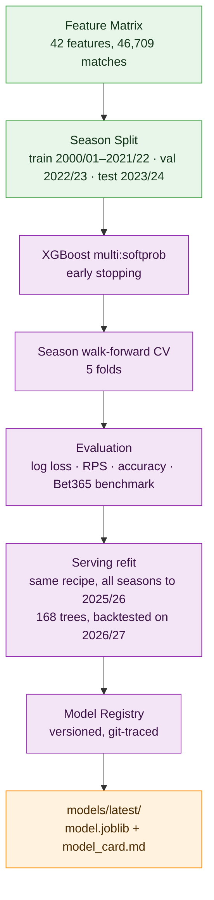
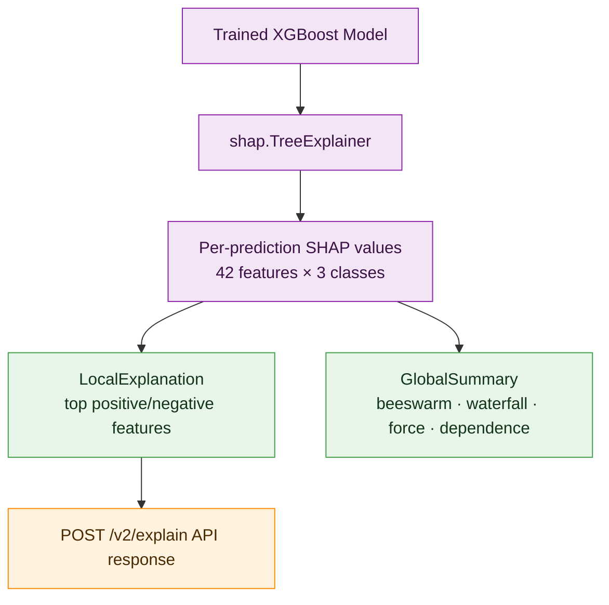
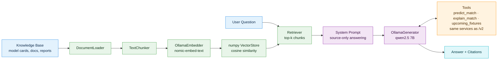
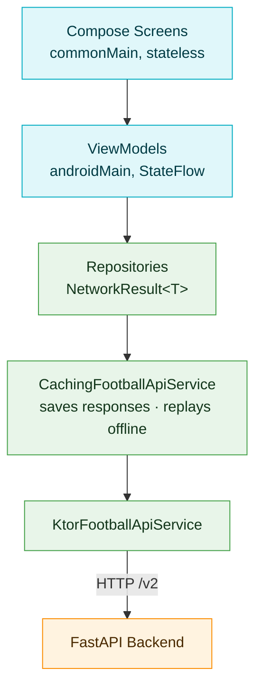

# Football Intelligence Platform

**An AI-first football analytics platform — from raw match data to an explainable, grounded, mobile-native prediction experience.**

[](.github/workflows) [](docs/reports/) [](LICENSE) [](ai/pyproject.toml) [](frontend/)

[](https://github.com/SumukhaK/football-intelligence-platform/releases/download/v2.0.0/football-intelligence-demo.mp4)

**▶ [Watch the 3-minute end-to-end demo](https://github.com/SumukhaK/football-intelligence-platform/releases/download/v2.0.0/football-intelligence-demo.mp4)**: narrated, with English subtitles. Scenes and the subtitle file are in [docs/showcase/demo-video](docs/showcase/demo-video/README.md).

---

## Project Overview

The Football Intelligence Platform ingests 26 seasons of match data from Europe's top five leagues (Premier League, Bundesliga, La Liga, Serie A and Ligue 1). It trains an XGBoost model to predict match outcomes, explains every prediction with SHAP, and adds likely scorelines and goal markets from a Dixon-Coles goals model. It surfaces all of this through a retrieval-augmented AI assistant and a native Android client.

It is a complete, working system — not a notebook or a prototype. Twelve build stages take it from an empty repository to a tested, documented, end-to-end product: ingestion → validation → feature engineering → model training → explainability → a FastAPI backend → a locally-grounded RAG assistant → a Compose Multiplatform Android app → full integration testing.

**945 tests: 872 Python and 73 Android. Every prediction carries a SHAP explanation. The assistant never invents facts. The server refreshes results and fixtures daily without a restart, and the app keeps working offline with the last data it saw.**

---

## Why This Project Exists

Most ML portfolio projects stop at a Jupyter notebook with an accuracy score. This one was built to answer a harder question: **what does it take to ship a model as a real, usable, explainable product?**

That means:

- A model that doesn't just predict — it explains *why*, on every single request, via SHAP.
- An AI assistant that doesn't hallucinate — every answer is grounded in retrieved data with citations, or it says it doesn't know.
- A mobile client that talks to real infrastructure, not mock data — the same FastAPI backend, the same model, the same explanations.
- A pipeline that is reproducible from a single command, with no manual notebook steps and no cloud dependency.
- Engineering discipline applied throughout: typed code, 79% Python test coverage behind a 70% CI gate, ADRs for every structural decision, and a clean layered architecture in both the Python and Kotlin codebases.

This project demonstrates AI engineering as a discipline: not just "can I train a model," but "can I build, explain, serve, test, and ship one."

---

## Key Capabilities

| Capability | Description |
|---|---|
| **Match outcome prediction** | XGBoost classifier predicting Home Win / Draw / Away Win for all five leagues, with a "draw possible" tag for tight games (ADR 011) |
| **Scorelines and goal markets** | Time-weighted Dixon-Coles goals model per league: five most likely scores, expected goals, both teams to score, over/under lines and clean sheets (ADR 009) |
| **Per-prediction explainability** | SHAP `TreeExplainer` attaches feature-level attribution to every prediction, shown in plain football language ("Arsenal win rate at home · 68%") |
| **Grounded AI assistant** | Local RAG pipeline (Ollama + numpy vector store) answers football questions using only retrieved platform data, with source citations, and calls the API's own prediction, explanation and fixtures services as tools for match questions (ADR 018); season questions (tables on any date with a goals-model projection, results, the next derby) go through a rule-based router to internal season tools (ADR 021) |
| **Production-shaped backend** | Versioned FastAPI (`/v1` frozen, `/v2` current, ADR 014), server-side match features, upcoming fixtures, a daily in-process data refresh (ADR 013), a per-client rate limit, invite-only sign-in with consent for hosted deployments (ADR 022), structured errors, OpenAPI docs |
| **Native Android client** | Compose Multiplatform app that opens on upcoming fixtures by league (tap one to predict it), with team crests, bottom navigation, a league picker, offline mode with saved data, pull to refresh, MVVM, StateFlow, Koin DI and previews for every screen |
| **Full reproducibility** | Entire pipeline (ingest → features → train → explain) runs in under 15 seconds from one CLI command |
| **End-to-end test coverage** | 970 Python tests (including 37 integration tests against the real model, most of which skip on a machine without one) and 80 Android tests (ViewModels written test-first, repositories, network, cache, loader) |
| **Zero cloud dependency** | Runs entirely on a laptop — no managed database, no cloud LLM, no hosted vector store |

---

## Architecture Diagram


```mermaid
flowchart TD
    A["⚽ Match results\nfootball-data.co.uk · 5 leagues · daily"] --> B
    FX["📅 Fixtures\nopenfootball · season schedules · daily"] --> FS

    subgraph AI["AI Workspace (ai/)"]
        B["Ingestion Pipeline\nDatasetDownloader · IngestionPipeline\nschema validation · versioned storage"] --> C
        C["Canonical Dataset\ndatasets/processed/\nProcessedMatch · 46,709 matches\ntop 5 leagues · 2000/01–2025/26"] --> D
        D["Feature Engineering\n9 feature generators · FeatureRegistry\nKahn topology sort · leakage prevention"] --> E
        E["Feature Matrix\n42 pre-match features · 46,709 rows"] --> F
        F["Model Training\nXGBoost · season-based split\nearly stopping · season walk-forward CV\nserved model refit on all seasons"] --> G
        G["Evaluation\naccuracy · F1 · log-loss · ROC AUC"] --> H
        H["Model Registry\nmodels/registry.json\ngit commit traceability"]
        F --> I["Model Artifacts\nmodels/latest/model.joblib"]
        FS["Fixtures Dataset\nteam names mapped · validated"]
    end

    I --> J["Explainability\nSHAP TreeExplainer · ExplanationService"]
    C --> NG["Goals Model\nDixon-Coles per league · fitted at startup"]
    J --> K["FastAPI Backend\n/v2: predict · explain · insights · fixtures · teams\n/v1: original Premier League model\nrate limited"]
    NG --> K
    FS --> K
    K --> L["AI Assistant\nOllama RAG · numpy vector store\ntools: predict · explain · fixtures"]
    K --> M["Android App\nCompose Multiplatform · MVVM · Ktor · Koin\noffline cache · pull to refresh"]

    classDef source fill:#E3F2FD,stroke:#1E88E5,color:#0D2A4A
    classDef data fill:#E8F5E9,stroke:#43A047,color:#12351A
    classDef model fill:#F3E5F5,stroke:#8E24AA,color:#3A1245
    classDef serve fill:#FFF3E0,stroke:#FB8C00,color:#4A2A00
    classDef client fill:#E0F7FA,stroke:#00ACC1,color:#003B44
    class A,FX source
    class B,C,D,E,FS data
    class F,G,H,I,J,NG model
    class K,L serve
    class M client
    style AI fill:#FAFAFA,stroke:#9E9E9E,color:#212121
```

---

## Technology Stack

| Layer | Technologies |
|---|---|
| **ML / Data** | Python 3.12, XGBoost 3.3, scikit-learn 1.9, SciPy (goals model), pandas, NumPy, PyArrow |
| **Explainability** | SHAP 0.52 (`TreeExplainer`), Matplotlib |
| **AI Assistant** | Ollama (`qwen2.5:7b-instruct`, `nomic-embed-text`), numpy vector store, custom RAG pipeline |
| **Backend** | FastAPI, Pydantic v2, `pydantic-settings`, uvicorn |
| **Mobile** | Kotlin, Compose Multiplatform, Ktor client, Koin DI, AndroidX Navigation Compose, Material 3 |
| **Tooling** | uv (Python dependency management), Gradle 8.8, Ruff, Black, MyPy, Detekt, Spotless |
| **Testing** | pytest (872 tests), JUnit 5, MockK, Ktor MockEngine (73 tests) |
| **CI/CD** | GitHub Actions |

---

## Repository Structure

```
.github/            # CI workflows, issue templates, PR template, CODEOWNERS
.claude/            # AI agent project instructions (architecture rules, coding standards)
docs/               # ADRs, stage reports, demo guides, release notes, showcase docs
playbook/           # Reserved for prompt template docs (prompts live in ai/assistant/prompting/)
frontend/           # Compose Multiplatform Android application (13 Gradle modules)
backend/            # Placeholder: the backend lives in ai/backend/
ai/                 # Python workspace: ingestion → features → training → explainability → RAG → API
datasets/           # Raw, processed, and feature-engineered football data (versioned, not committed)
scripts/            # Setup and automation scripts
tools/              # Shared CLI utilities
```

---

## AI Pipeline Overview

The `ai/` workspace is a single Python project (managed with [uv](https://github.com/astral-sh/uv)) that owns the entire ML lifecycle:


```mermaid
flowchart LR
    A[Raw CSV\nfootball-data.co.uk] --> B[DatasetValidator\n9 quality rules]
    B --> C[ProcessedMatch\n46,709 matches, 5 leagues]
    C --> D[FeatureRegistry\n9 generators, Kahn sort]
    D --> E[Feature Matrix\n42 features × 46,709 rows]
    E --> F[XGBoost Training\nseason-based split]
    F --> G[Model Registry\nJSON + git commit]

    classDef source fill:#E3F2FD,stroke:#1E88E5,color:#0D2A4A
    classDef data fill:#E8F5E9,stroke:#43A047,color:#12351A
    classDef model fill:#F3E5F5,stroke:#8E24AA,color:#3A1245
    class A source
    class B,C,D,E data
    class F,G model
```

Every transformation is a reproducible script — never a notebook. Raw data is immutable; nothing downstream ever overwrites a source file.

## Application Architecture

The system follows Clean Architecture with strict, one-directional layer dependencies:

| Layer | Responsibility |
|---|---|
| Domain | Entities, value objects, business rules |
| Application | Use cases, service interfaces, DTOs |
| Infrastructure | Database, external APIs, file I/O, ML models |
| Presentation | FastAPI routes, Compose UI, ViewModels |

The AI layer is decoupled from the backend — the backend calls into AI services through a clean interface and never touches model internals directly. The Android frontend uses MVVM: ViewModels own state as `StateFlow`; Composables are pure functions of state.

## Model Training Pipeline


```mermaid
flowchart TD
    A[Feature Matrix\n42 features, 46,709 matches] --> B[Season Split\ntrain 2000/01–2021/22 · val 2022/23 · test 2023/24]
    B --> C[XGBoost multi:softprob\nearly stopping]
    C --> D[Season walk-forward CV\n5 folds]
    D --> E[Evaluation\nlog loss · RPS · accuracy · Bet365 benchmark]
    E --> R[Serving refit\nsame recipe, all seasons to 2025/26\n168 trees, backtested on 2026/27]
    R --> F[Model Registry\nversioned, git-traced]
    F --> G[models/latest/\nmodel.joblib + model_card.md]

    classDef data fill:#E8F5E9,stroke:#43A047,color:#12351A
    classDef model fill:#F3E5F5,stroke:#8E24AA,color:#3A1245
    classDef serve fill:#FFF3E0,stroke:#FB8C00,color:#4A2A00
    class A,B data
    class C,D,E,R,F model
    class G serve
```

Whole seasons are assigned to train, validation and test, so the model never trains on the future; see [ADR 007](docs/adr/007-season-based-split-and-evaluation.md). 2024/25 and 2025/26 are held back as an out-of-time check. Hyperparameters are chosen by season cross-validation on training seasons only (`training.tuning`). Result on the 2023/24 test season across all five leagues: **52.5% accuracy, log loss 0.976** on a 3-class problem (random baseline: 33.3%; bookmakers 55.0% and 0.955). Details: [model comparison report](docs/reports/multi-league-retraining-comparison.md).

**Two models, two jobs (ADR 017).** Those test figures come from the frozen-split model `20260928_123224`, trained on 2000/01–2021/22 only, so its test and holdout seasons stay unseen. The model the API serves, `20261007_154105`, is a refit of the same recipe on every season from 2000/01 to 2025/26 (46,709 matches): the same 42 pinned features and settings, a fixed 168 trees (the frozen run's best iteration) and no early stopping. It has no held-out season of its own, so it was checked on the 2026/27 matches played so far before it replaced the frozen model on 7 October 2026 (see [the refit report](docs/reports/refit-all-seasons.md)). The frozen model stays in `models/runs/` as the reporting model and the rollback.

## Explainability Pipeline


```mermaid
flowchart TD
    A[Trained XGBoost Model] --> B[shap.TreeExplainer]
    B --> C[Per-prediction SHAP values\n42 features × 3 classes]
    C --> D[LocalExplanation\ntop positive/negative features]
    C --> E[GlobalSummary\nbeeswarm · waterfall · force · dependence]
    D --> F[POST /v2/explain API response]

    classDef data fill:#E8F5E9,stroke:#43A047,color:#12351A
    classDef model fill:#F3E5F5,stroke:#8E24AA,color:#3A1245
    classDef serve fill:#FFF3E0,stroke:#FB8C00,color:#4A2A00
    class A,B,C model
    class D,E data
    class F serve
```

Every prediction is explainable — not as an afterthought, but as a first-class API response. See [ADR 004](docs/adr/004-shap-for-explainability.md) for why SHAP was chosen over LIME, native XGBoost importance, and Captum.

## Football Intelligence Assistant


```mermaid
flowchart LR
    A[Knowledge Base\nmodel cards, docs, reports] --> B[DocumentLoader]
    B --> C[TextChunker]
    C --> D[OllamaEmbedder\nnomic-embed-text]
    D --> E[numpy VectorStore\ncosine similarity]
    F[User Question] --> G[Retriever\ntop-k chunks]
    E --> G
    G --> H[System Prompt\nsource-only answering]
    H --> I[OllamaGenerator\nqwen2.5 7B]
    I <--> T[Tools\npredict_match · explain_match · upcoming_fixtures\nsame services as /v2]
    I --> J[Answer + Citations]

    classDef source fill:#E3F2FD,stroke:#1E88E5,color:#0D2A4A
    classDef data fill:#E8F5E9,stroke:#43A047,color:#12351A
    classDef model fill:#F3E5F5,stroke:#8E24AA,color:#3A1245
    classDef serve fill:#FFF3E0,stroke:#FB8C00,color:#4A2A00
    classDef client fill:#E0F7FA,stroke:#00ACC1,color:#003B44
    class A,F source
    class B,C,D,E,G data
    class H,I model
    class T serve
    class J client
```

The assistant is instructed, by system prompt, to answer **only** from retrieved context or tool results. Chunks scoring below 0.81 are dropped before generation, so an off-topic question reaches the model with no context and gets the prompt's fixed "I don't have enough information" reply. If Ollama isn't running, the backend degrades gracefully — `POST /assistant/chat` returns `503`, never a crash.

**Tool calling (ADR 018).** For a match prediction, its explanation or a league's upcoming fixtures, the model calls `predict_match`, `explain_match` or `upcoming_fixtures`. These run the same services as `/v2/predict`, `/v2/explain` and `/v2/fixtures`, in-process, so the assistant quotes exactly what the API returns from the live model, cited as `[source: tool <name>]`. `OLLAMA_CHAT_MODEL` must name a model that supports tool calling (the default `qwen2.5:7b-instruct` does).

**Season tools and router (ADR 021).** Two internal tools answer season questions: `team_matches` (results, head-to-head and the next meeting this season) and `league_table` (the table on any date; for a date still ahead, each remaining fixture is simulated 10,000 times with the goals model to give expected points, goals and clean sheets and the chance of finishing first, top four or bottom three). A rule-based router reads every question first: player and next-season questions get a fixed reply without the model, and table, results and derby questions get their tool calls decided in code, so the 7B model only writes the answer. Season eval (`evaluation.assistant_season`): **7 of 7**, against 3 of 7 without the router.

**Evaluation** (run locally on 7 October 2026 with `qwen2.5:7b-instruct`; both need Ollama and the trained model, so CI runs only their scoring tests):

- **Tool calling** (`evaluation.assistant_grounding`): **11 of 11** correct, against 1 of 11 without tools. That is ten upcoming fixtures across the five leagues, where the answer must quote the probability `/v2/predict` gives and no number the API didn't return, plus a team that doesn't exist, where it must not invent numbers.
- **Saying "I don't know"** (`evaluation.assistant_abstention`): **20 of 20**: 10 of 10 off-topic questions refused with the exact phrase and 10 of 10 answerable ones answered. This 7B model also scored 20 of 20 with the old, ineffective cut-off; the 0.81 cut-off matters most for smaller models.
- **Choosing the model (ADR 019):** `llama3.2` (3B, the previous default) scored 5 of 11 and 15 of 20, misquoting probabilities and refusing answerable questions; `qwen2.5:14b-instruct` matched the 7B model. The 7B model is the default as the smallest that passes both.

## Android Application


```mermaid
flowchart TD
    A[Compose Screens\ncommonMain, stateless] --> B[ViewModels\nandroidMain, StateFlow]
    B --> C[Repositories\nNetworkResult&lt;T&gt;]
    C --> X[CachingFootballApiService\nsaves responses · replays offline]
    X --> D[KtorFootballApiService]
    D -- "HTTP /v2" --> E[FastAPI Backend]

    classDef data fill:#E8F5E9,stroke:#43A047,color:#12351A
    classDef serve fill:#FFF3E0,stroke:#FB8C00,color:#4A2A00
    classDef client fill:#E0F7FA,stroke:#00ACC1,color:#003B44
    class A,B client
    class C,X,D data
    class E serve
```

The app opens on upcoming fixtures, grouped by day, with one tab per league and the Premier League first; kick-off times are in the phone's time zone. Tapping a fixture opens its prediction. Team crests and league emblems come from football-data.org through the API's redirects (ADR 020). On first launch the app asks for a favourite league and team. A bottom bar switches between Fixtures, Predict, My Team and Assistant, with Settings behind a top-right icon. My Team shows the favourite team's next match with its pick, top three reasons, likeliest scores and clean-sheet chance. Prediction starts with a league picker filled from `GET /v2/competitions`, and the result shows win/draw/loss probabilities, a draw tag for tight games, and the goals model's likely scores and goal markets. Every answer is saved: without a connection the app shows the last data it had under an offline banner, and pulling down fetches fresh data. Errors are explained in plain language. See [frontend/README.md](frontend/README.md) for the full module graph.

## Backend Services

FastAPI serves two API versions (ADR 014), documented automatically via OpenAPI and in [docs/api.md](docs/api.md). `/v2` is current:

| Endpoint | Method | Purpose |
|---|---|---|
| `/v2/health` | GET | Service status, latest result date and last data refresh |
| `/v2/model` | GET | Model version, training metadata, evaluation metrics |
| `/v2/competitions` | GET | The five served leagues and how current each one is |
| `/v2/teams` | GET | A league's current teams (`?competition=`) |
| `/v2/fixtures` | GET | A league's upcoming fixtures from today on (ADR 015) |
| `/v2/predict` | POST | Win/draw/loss prediction; the server computes features from history (ADR 008) |
| `/v2/explain` | POST | Prediction plus SHAP attribution in plain football language |
| `/v2/insights` | POST | Likely scores, expected goals and goal markets from the goals model |
| `/v2/assistant/chat` | POST | RAG-grounded football Q&A, with tools and a season router |
| `/v2/teams/{team}/crest`, `/v2/competitions/{name}/emblem` | GET | Redirect to the crest or emblem image (ADR 020) |
| `/v2/auth/*`, `/v2/me` | POST/GET | Invite-only sign-in and consent (ADR 022) |

With `AUTH_REQUIRED=true` (staging and production), every `/v2` data route needs a signed-in user who has accepted the consent notice, and `/v1` is not mounted; health, docs, sign-in and crest images stay open. It is off by default, so local development needs no account.

`/v1` and the unversioned paths keep the v1.0.0 contract: the original Premier League model and the original response fields, so older clients keep working. Requests name a league with an optional `competition` and default to the Premier League (ADR 012). Each client may make 120 requests a minute before a `429` (`RATE_LIMIT_PER_MINUTE`). Dependency injection happens once at FastAPI lifespan startup, and the daily refresh swaps in new results and fixtures without a restart (ADR 013). Structured errors: `503` (service unavailable), `429` (rate limit), `401`/`403` (not signed in, consent required, blocked), `422` (unknown league or team, validation), `500` (unexpected, logged).

---

## Quick Start

### Running the AI Pipeline

```sh
cd ai
uv sync --extra dev

uv run python -m scripts.backfill_football_data --base-dir ../datasets --confirm
uv run python -m feature_engineering.pipeline --input ../datasets/processed/football_data/match_results_top5_v<ts>.csv --output-dir ../datasets/features/top5
uv run python -m training.pipeline --feature-matrix ../datasets/features/top5/feature_matrix.parquet --split-strategy season --val-seasons 2022/23 --test-seasons 2023/24 --holdout-seasons 2024/25 2025/26 --max-depth 3 --learning-rate 0.03 --n-estimators 400
uv run python -m explainability.pipeline --feature-matrix ../datasets/features/top5/feature_matrix.parquet
```

The training command above serves the frozen-split model. To serve a refit on every completed season, as the live API does (ADR 017), refit it, backtest it on the season so far and promote it (`<v>` is the run the refit prints, `<in-season run>` the folder `in_season_cli` writes):

```sh
uv run python -m training.refit --source-run models/runs/<frozen run> --last-season 2025/26
uv run python -m evaluation.in_season_cli --season 2627 --model models/runs/<frozen run>/model.joblib --confirm
uv run python -m evaluation.refit_backtest --rows models/backtests/<in-season run>/features/feature_matrix.parquet --frozen-run models/runs/<frozen run> --refit-run models/runs/<v>
uv run python -m training.promote_refit --run models/runs/<v> --backtest models/backtests/refit_<v>/report.json
```

### Running the Backend

```sh
cd ai
cp .env.example .env   # optional: every value in it is already the default
uv run uvicorn backend.app.main:app --reload
```

Visit `http://127.0.0.1:8000/docs` for interactive OpenAPI documentation. At startup the server loads the newest match and fixtures datasets and fits a goals model per league, downloading fixtures straight away if it has none. From then on it downloads the latest results and fixtures every day at 06:00 local time. Set `LIVE_REFRESH_HOUR=off` in `.env` to work offline. Every setting is listed in [`ai/.env.example`](ai/.env.example).

To enable the AI assistant (optional, requires [Ollama](https://ollama.com)):

```sh
ollama pull nomic-embed-text
ollama pull qwen2.5:7b-instruct
uv run python -m assistant.pipeline --rebuild
```

### Running Android

```sh
cd frontend
./gradlew assembleDebug
adb install app/build/outputs/apk/debug/app-debug.apk
```

The app calls API v2 at `http://10.0.2.2:8000/v2` (the Android emulator's alias for the host machine's localhost).

### Running Tests

```sh
# Python: 872 tests (the 37 integration tests need a trained model)
cd ai && uv run pytest

# Android: unit tests, lint and formatting (73 tests)
cd frontend && ./gradlew testDebugUnitTest detekt spotlessCheck
```

---

## Project Documentation

| Document | Purpose |
|---|---|
| [Documentation Index](docs/README.md) | Full documentation map |
| [ADR Index](docs/adr/README.md) | All 18 architectural decision records |
| [Stage Reports](docs/reports/) | Detailed report for every build stage (1–12) |
| [Demo Scripts](docs/demo/README.md) | Per-stage manual verification guides |
| [Showcase Demo](docs/showcase/demo-script.md) | 5, 10 and 20-minute demo scripts and a [screenshot checklist](docs/showcase/screenshots/README.md) |
| [CLI Reference](docs/reference/cli.md) | All pipeline commands |
| [Quick Start Guide](docs/setup/quick-start.md) | Fastest path to a running system |
| [Troubleshooting](docs/troubleshooting.md) | Common issues and fixes |
| [AI Layer](ai/README.md) | Python workspace structure |
| [Backend](backend/README.md) | Backend service notes |
| [Frontend](frontend/README.md) | Android module structure |
| [API Reference](docs/api.md) | Every endpoint, both API versions, errors and rate limit |
| [Project Showcase](docs/showcase/project-showcase.md) | Full technical write-up for this project |
| [Portfolio Summary](docs/showcase/portfolio-summary.md) | Two-page recruiter-facing summary |
| [Interview Guide](docs/showcase/interview-guide.md) | 50 likely interview questions with answers |

---

## Release History

| Version | Date | Highlights |
|---|---|---|
| [v2.1.0](docs/releases/v2.1.0.md) | 2026-09-29 | App icon, Kick-off launch screen and loader, develop and main branch flow |
| [v2.0.1](docs/releases/v2.0.1.md) | 2026-09-29 | Offline fallback within seconds, demo video |
| [v2.0.0](docs/releases/v2.0.0.md) | 2026-09-29 | Five leagues, versioned API, fixtures, goals model, offline app, daily refresh |
| [v1.0.0](docs/releases/v1.0.0.md) | 2026-07-01 | Android app, end-to-end integration tests, performance benchmarks, production readiness |
| [v0.2.0](docs/releases/v0.2.0.md) | 2026-06-30 | SHAP explainability, FastAPI backend, RAG assistant |
| [v0.1.0](docs/releases/v0.1.0.md) | — | Data pipeline, feature engineering, XGBoost training |

Build stages 1–12 (repository foundation through integration and production readiness) are complete; see the [stage reports](docs/reports/). The follow-on phase ([plan](docs/plans/next-phase-plan.md)) added the five leagues, server-side features, plain-language explanations, draw handling, scoreline predictions, a daily data refresh, API versions with a rate limit, upcoming fixtures and an offline-ready app. These shipped as [v2.0.0](docs/releases/v2.0.0.md).

---

## License

MIT License. See [LICENSE](LICENSE).

## Acknowledgements

- [football-data.co.uk](https://www.football-data.co.uk/) for Premier League, Bundesliga, La Liga, Serie A and Ligue 1 results, 2000/01 onwards.
- [openfootball](https://github.com/openfootball/football.json) for public-domain season schedules used for upcoming fixtures.
- Kaggle datasets by armin2080, enricocattaneo and adrianjuliusaluoch, used to test xG, FIFA ratings and Champions League rest days ([report](docs/reports/kaggle-extras.md)).
- [Ollama](https://ollama.com) for local LLM serving (`qwen2.5:7b-instruct`, `nomic-embed-text`).
- [SHAP](https://github.com/shap/shap) for the `TreeExplainer` implementation underpinning all explainability features.
- [XGBoost](https://xgboost.readthedocs.io/), [JetBrains Compose Multiplatform](https://www.jetbrains.com/lp/compose-multiplatform/), and [FastAPI](https://fastapi.tiangolo.com/) as the core frameworks this project is built on.

---

## 2026/27 Season So Far: How Accurate Is the Model?

We asked the models to predict every 2026/27 league match played up to 20 September 2026 across the five leagues (250 matches), without feeding them the real results. Each match was predicted using only the results of matches played before it, and the prediction was then compared with what actually happened. Neither model had seen any 2026/27 match.

- **Live model `20261007_154105`** (served since 7 October 2026): trained on every season from 2000/01 to 2025/26.
- **Previous model `20260928_123224`**: trained on 2000/01–2021/22 only. It is still the model the 2023/24 test figures above come from.

**The bookmaker we compare against** is Bet365, using its pre-match odds from football-data.co.uk (columns `B365H`, `B365D`, `B365A`). football-data.co.uk collects these before kick-off, on Friday afternoons for weekend games and Tuesday afternoons for midweek games; they are not closing odds. The bookmaker's margin is removed by scaling the three implied probabilities so they add up to 1. The odds are scored on exactly the same 250 matches and are only a benchmark: they are never a model input.

Accuracy is the share of matches where the most likely outcome was the actual result.

| Competition | Matches | Live model (refit) | Previous model | Bet365 |
|---|---|---|---|---|
| Serie A | 50 | 31 (62.0%) | 31 (62.0%) | 28 (56.0%) |
| Ligue 1 | 45 | 25 (55.6%) | 25 (55.6%) | 22 (48.9%) |
| Bundesliga | 36 | 18 (50.0%) | 18 (50.0%) | 19 (52.8%) |
| La Liga | 69 | 34 (49.3%) | 34 (49.3%) | 38 (55.1%) |
| Premier League | 50 | 22 (44.0%) | 23 (46.0%) | 22 (44.0%) |
| **Overall** | **250** | **130 (52.0%)** | **131 (52.4%)** | **129 (51.6%)** |

Log loss, where lower is better: live model 0.976, previous model 0.975, Bet365 0.981.

**How sure can we be?** With only 250 matches, every figure has a wide margin. The ranges below are 95% bootstrap ranges: the matches were resampled 2,000 times and the comparison redone on each sample.

- **Live model against Bet365: level.** Its accuracy is 0.4 points higher, but the range runs from 2.8 points lower to 3.6 points higher. Its log loss is 0.005 lower, with a range from 0.026 lower to 0.016 higher. Both ranges include zero, so neither side is ahead.
- **Live model against the previous model: level.** Only 3 of the 250 picks differ; the log loss difference is between −0.005 and +0.007.
- **Previous model against an Elo-only baseline: clearly better.** A forecast from team strength ratings alone gets 48.8% right. The previous model's accuracy is 3.7 points higher (range +0.8 to +6.8) and its log loss 0.030 lower (range 0.010 to 0.051 lower), so the other features add real information.
- **Previous model's own ranges:** accuracy 52.4% (46.4% to 58.8%), log loss 0.975 (0.930 to 1.020). Bet365: 51.6% (45.6% to 57.6%).

Per-league samples are small, so league-to-league differences are not reliable yet. Full write-ups: [refit report](docs/reports/refit-all-seasons.md) and [2026/27 live check](docs/reports/in-season-2026-27.md).
