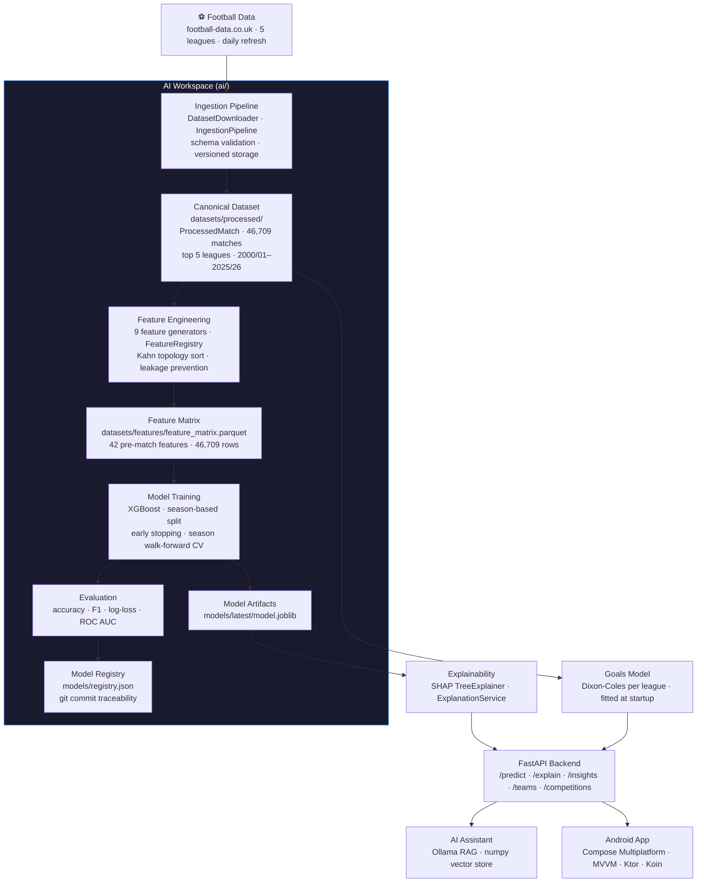
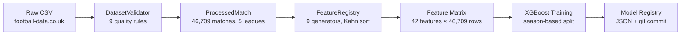
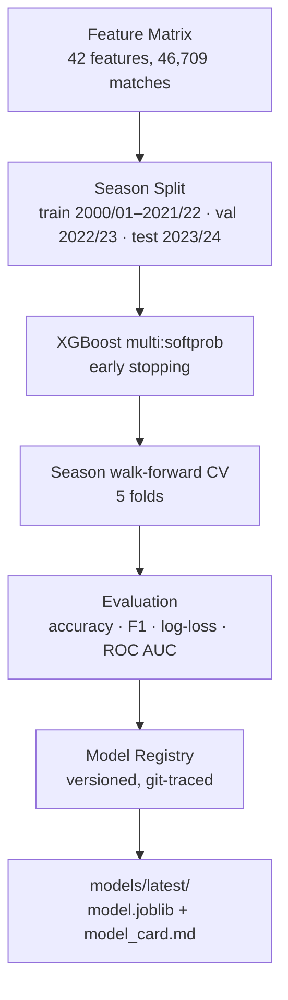
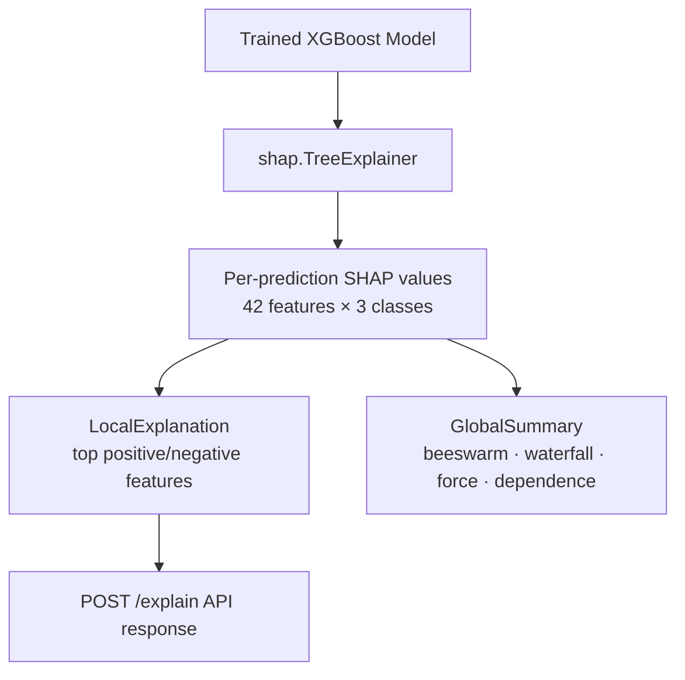
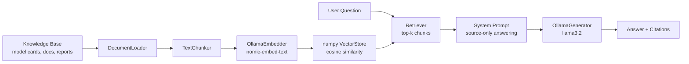
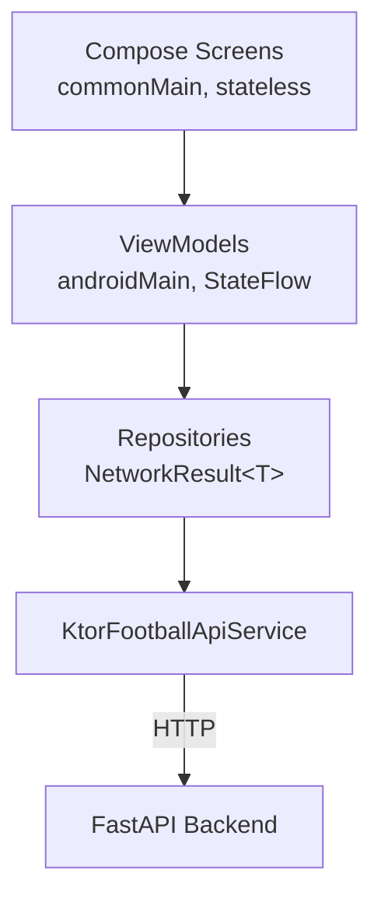

# Football Intelligence Platform

**An AI-first football analytics platform — from raw match data to an explainable, grounded, mobile-native prediction experience.**

[](.github/workflows) [](docs/reports/) [](LICENSE) [](ai/pyproject.toml) [](frontend/)

---

## Project Overview

The Football Intelligence Platform ingests 26 seasons of match data from Europe's top five leagues (Premier League, Bundesliga, La Liga, Serie A and Ligue 1). It trains an XGBoost model to predict match outcomes, explains every prediction with SHAP, and adds likely scorelines and goal markets from a Dixon-Coles goals model. It surfaces all of this through a retrieval-augmented AI assistant and a native Android client.

It is a complete, working system — not a notebook or a prototype. Twelve build stages take it from an empty repository to a tested, documented, end-to-end product: ingestion → validation → feature engineering → model training → explainability → a FastAPI backend → a locally-grounded RAG assistant → a Compose Multiplatform Android app → full integration testing.

**796 tests pass (756 Python, 40 Android). Every prediction carries a SHAP explanation. The assistant never invents facts. The server refreshes its data daily without a restart.**

---

## Why This Project Exists

Most ML portfolio projects stop at a Jupyter notebook with an accuracy score. This one was built to answer a harder question: **what does it take to ship a model as a real, usable, explainable product?**

That means:

- A model that doesn't just predict — it explains *why*, on every single request, via SHAP.
- An AI assistant that doesn't hallucinate — every answer is grounded in retrieved data with citations, or it says it doesn't know.
- A mobile client that talks to real infrastructure, not mock data — the same FastAPI backend, the same model, the same explanations.
- A pipeline that is reproducible from a single command, with no manual notebook steps and no cloud dependency.
- Engineering discipline applied throughout: typed code, 80%+ test coverage, ADRs for every structural decision, and a clean layered architecture in both the Python and Kotlin codebases.

This project demonstrates AI engineering as a discipline: not just "can I train a model," but "can I build, explain, serve, test, and ship one."

---

## Key Capabilities

| Capability | Description |
|---|---|
| **Match outcome prediction** | XGBoost classifier predicting Home Win / Draw / Away Win for all five leagues, with a "draw possible" tag for tight games (ADR 011) |
| **Scorelines and goal markets** | Time-weighted Dixon-Coles goals model per league: five most likely scores, expected goals, both teams to score, over/under lines and clean sheets (ADR 009) |
| **Per-prediction explainability** | SHAP `TreeExplainer` attaches feature-level attribution to every prediction, shown in plain football language ("Arsenal win rate at home · 68%") |
| **Grounded AI assistant** | Local RAG pipeline (Ollama + numpy vector store) answers football questions using only retrieved platform data, with source citations |
| **Production-shaped backend** | FastAPI with 8 REST endpoints, server-side match features, a daily in-process data refresh (ADR 013), structured errors, OpenAPI docs |
| **Native Android client** | 8-screen Compose Multiplatform app with a league picker, MVVM, StateFlow, Koin DI, string resources and previews for every screen |
| **Full reproducibility** | Entire pipeline (ingest → features → train → explain) runs in under 15 seconds from one CLI command |
| **End-to-end test coverage** | 756 Python tests (unit and integration against the real model) and 40 Android tests (ViewModels written test-first, repositories, network) |
| **Zero cloud dependency** | Runs entirely on a laptop — no managed database, no cloud LLM, no hosted vector store |

---

## Architecture Diagram


```mermaid
flowchart TD
    A["⚽ Football Data\nfootball-data.co.uk · 5 leagues · daily refresh"] --> B

    subgraph AI["AI Workspace (ai/)"]
        B["Ingestion Pipeline\nDatasetDownloader · IngestionPipeline\nschema validation · versioned storage"] --> C
        C["Canonical Dataset\ndatasets/processed/\nProcessedMatch · 46,709 matches\ntop 5 leagues · 2000/01–2025/26"] --> D
        D["Feature Engineering\n9 feature generators · FeatureRegistry\nKahn topology sort · leakage prevention"] --> E
        E["Feature Matrix\ndatasets/features/feature_matrix.parquet\n42 pre-match features · 46,709 rows"] --> F
        F["Model Training\nXGBoost · season-based split\nearly stopping · season walk-forward CV"] --> G
        G["Evaluation\naccuracy · F1 · log-loss · ROC AUC"] --> H
        H["Model Registry\nmodels/registry.json\ngit commit traceability"]
        F --> I["Model Artifacts\nmodels/latest/model.joblib"]
    end

    I --> J["Explainability\nSHAP TreeExplainer · ExplanationService"]
    C --> N["Goals Model\nDixon-Coles per league · fitted at startup"]
    J --> K["FastAPI Backend\n/predict · /explain · /insights · /teams · /competitions"]
    N --> K
    K --> L["AI Assistant\nOllama RAG · numpy vector store"]
    K --> M["Android App\nCompose Multiplatform · MVVM · Ktor · Koin"]

    style AI fill:#1a1a2e,stroke:#4a9eff,color:#ffffff
```

---

## Technology Stack

| Layer | Technologies |
|---|---|
| **ML / Data** | Python 3.12, XGBoost 3.0, scikit-learn 1.9, SciPy (goals model), pandas, NumPy, PyArrow |
| **Explainability** | SHAP 0.46 (`TreeExplainer`), Matplotlib |
| **AI Assistant** | Ollama (`llama3.2`, `nomic-embed-text`), numpy vector store, custom RAG pipeline |
| **Backend** | FastAPI, Pydantic v2, `pydantic-settings`, uvicorn |
| **Mobile** | Kotlin, Compose Multiplatform, Ktor client, Koin DI, AndroidX Navigation Compose, Material 3 |
| **Tooling** | uv (Python dependency management), Gradle 8.8, Ruff, Black, MyPy, Detekt, Spotless |
| **Testing** | pytest (756 tests), JUnit 5, MockK, Ktor MockEngine (40 tests) |
| **CI/CD** | GitHub Actions |

---

## Repository Structure

```
.github/            # CI workflows, issue templates, PR template, CODEOWNERS
.claude/            # AI agent project instructions (architecture rules, coding standards)
docs/               # ADRs, stage reports, demo guides, release notes, showcase docs
playbook/           # Prompt templates and retrieval configs (version-controlled, tested)
frontend/           # Compose Multiplatform Android application (13 Gradle modules)
backend/            # (legacy scaffold — active backend lives in ai/backend/)
ai/                 # Python workspace: ingestion → features → training → explainability → RAG → API
datasets/           # Raw, processed, and feature-engineered football data (versioned)
models/             # Trained model artifacts, registry, evaluation reports
scripts/            # Setup and automation scripts
tools/              # Shared CLI utilities
```

---

## AI Pipeline Overview

The `ai/` workspace is a single Python project (managed with [uv](https://github.com/astral-sh/uv)) that owns the entire ML lifecycle:


```mermaid
flowchart LR
    A[Raw CSV\nfootball-data.co.uk] --> B[DatasetValidator\n9 quality rules]
    B --> C[ProcessedMatch\n46,709 matches, 5 leagues]
    C --> D[FeatureRegistry\n9 generators, Kahn sort]
    D --> E[Feature Matrix\n42 features × 46,709 rows]
    E --> F[XGBoost Training\nseason-based split]
    F --> G[Model Registry\nJSON + git commit]
```

Every transformation is a reproducible script — never a notebook. Raw data is immutable; nothing downstream ever overwrites a source file.

## Application Architecture

The system follows Clean Architecture with strict, one-directional layer dependencies:

| Layer | Responsibility |
|---|---|
| Domain | Entities, value objects, business rules |
| Application | Use cases, service interfaces, DTOs |
| Infrastructure | Database, external APIs, file I/O, ML models |
| Presentation | FastAPI routes, Compose UI, ViewModels |

The AI layer is decoupled from the backend — the backend calls into AI services through a clean interface and never touches model internals directly. The Android frontend uses MVVM: ViewModels own state as `StateFlow`; Composables are pure functions of state.

## Model Training Pipeline


```mermaid
flowchart TD
    A[Feature Matrix\n42 features, 46,709 matches] --> B[Season Split\ntrain 2000/01–2021/22 · val 2022/23 · test 2023/24]
    B --> C[XGBoost multi:softprob\nearly stopping]
    C --> D[Season walk-forward CV\n5 folds]
    D --> E[Evaluation\naccuracy · F1 · log-loss · ROC AUC]
    E --> F[Model Registry\nversioned, git-traced]
    F --> G[models/latest/\nmodel.joblib + model_card.md]
```

Whole seasons are assigned to train, validation and test, so the model never trains on the future; see [ADR 007](docs/adr/007-season-based-split-and-evaluation.md). 2024/25 and 2025/26 are held back as an out-of-time check. Hyperparameters are chosen by season cross-validation on training seasons only (`training.tuning`). Result on the 2023/24 test season across all five leagues: **52.5% accuracy, log loss 0.976** on a 3-class problem (random baseline: 33.3%; bookmakers 55.0% and 0.955). Details: [model comparison report](docs/reports/multi-league-retraining-comparison.md).

## Explainability Pipeline


```mermaid
flowchart TD
    A[Trained XGBoost Model] --> B[shap.TreeExplainer]
    B --> C[Per-prediction SHAP values\n42 features × 3 classes]
    C --> D[LocalExplanation\ntop positive/negative features]
    C --> E[GlobalSummary\nbeeswarm · waterfall · force · dependence]
    D --> F[POST /explain API response]
```

Every prediction is explainable — not as an afterthought, but as a first-class API response. See [ADR 004](docs/adr/004-shap-for-explainability.md) for why SHAP was chosen over LIME, native XGBoost importance, and Captum.

## Football Intelligence Assistant


```mermaid
flowchart LR
    A[Knowledge Base\nmodel cards, docs, reports] --> B[DocumentLoader]
    B --> C[TextChunker]
    C --> D[OllamaEmbedder\nnomic-embed-text]
    D --> E[numpy VectorStore\ncosine similarity]
    F[User Question] --> G[Retriever\ntop-k chunks]
    E --> G
    G --> H[System Prompt\nsource-only answering]
    H --> I[OllamaGenerator\nllama3.2]
    I --> J[Answer + Citations]
```

The assistant is instructed, by system prompt, to answer **only** from retrieved context. Low-relevance chunks are filtered before generation. If Ollama isn't running, the backend degrades gracefully — `POST /assistant/chat` returns `503`, never a crash.

## Android Application


```mermaid
flowchart TD
    A[Compose Screens\ncommonMain, stateless] --> B[ViewModels\nandroidMain, StateFlow]
    B --> C[Repositories\nNetworkResult&lt;T&gt;]
    C --> D[KtorFootballApiService]
    D -- HTTP --> E[FastAPI Backend]
```

8 screens (Home, Match Prediction, Prediction Result, Explain Prediction, AI Assistant Chat, Model Information, Settings, About), all backed by `StateFlow<UiState>` ViewModels and Koin dependency injection. Team selection starts with a league picker filled from `GET /competitions`. The result shows win/draw/loss probabilities, a draw tag for tight games, and the goals model's likely scores and goal markets. Errors are explained in plain language. See [frontend/README.md](frontend/README.md) for the full module graph.

## Backend Services

FastAPI exposes eight REST endpoints, all documented automatically via OpenAPI and in [docs/api.md](docs/api.md):

| Endpoint | Method | Purpose |
|---|---|---|
| `/health` | GET | Service status, latest result date and last data refresh |
| `/model` | GET | Model version, training metadata, evaluation metrics |
| `/competitions` | GET | The five served leagues and how current each one is |
| `/teams` | GET | A league's current teams (`?competition=`) |
| `/predict` | POST | Win/draw/loss prediction; the server computes features from history (ADR 008) |
| `/explain` | POST | Prediction plus SHAP attribution in plain football language |
| `/insights` | POST | Likely scores, expected goals and goal markets from the goals model |
| `/assistant/chat` | POST | RAG-grounded football Q&A |

Requests name a league with an optional `competition` and default to the Premier League (ADR 012). Dependency injection happens once at FastAPI lifespan startup, and the daily refresh swaps in new data without a restart (ADR 013). Structured errors: `503` (service unavailable), `422` (unknown league or team, validation), `500` (unexpected, logged).

---

## Screenshots and Demo

See the [screenshot checklist](docs/showcase/screenshots/README.md) and the 5/10/20-minute [demo scripts](docs/showcase/demo-script.md).

---

## Quick Start

### Running the AI Pipeline

```sh
cd ai
uv sync --extra dev

uv run python -m scripts.backfill_football_data --base-dir ../datasets --confirm
uv run python -m feature_engineering.pipeline --input ../datasets/processed/football_data/match_results_top5_v<ts>.csv --output-dir ../datasets/features/top5
uv run python -m training.pipeline --feature-matrix ../datasets/features/top5/feature_matrix.parquet --split-strategy season --val-seasons 2022/23 --test-seasons 2023/24 --holdout-seasons 2024/25 2025/26 --max-depth 3 --learning-rate 0.03 --n-estimators 400
uv run python -m explainability.pipeline --feature-matrix ../datasets/features/top5/feature_matrix.parquet
```

### Running the Backend

```sh
cd ai
cp .env.example .env   # optional: every value in it is already the default
uv run uvicorn backend.app.main:app --reload
```

Visit `http://127.0.0.1:8000/docs` for interactive OpenAPI documentation. At startup the server loads the newest match dataset and fits a goals model per league. From then on it downloads the latest results every day at 06:00 local time. Set `LIVE_REFRESH_HOUR=off` in `.env` to work offline. Every setting is listed in [`ai/.env.example`](ai/.env.example).

To enable the AI assistant (optional, requires [Ollama](https://ollama.com)):

```sh
ollama pull nomic-embed-text
ollama pull llama3.2
uv run python -m assistant.pipeline --rebuild
```

### Running Android

```sh
cd frontend
./gradlew assembleDebug
adb install app/build/outputs/apk/debug/app-debug.apk
```

The app targets `http://10.0.2.2:8000` (the Android emulator's alias for the host machine's localhost).

### Running Tests

```sh
# Python: unit + integration (756 tests)
cd ai && uv run pytest

# Python: unit tests only
uv run pytest -m "not integration"

# Android: unit tests, lint and formatting (40 tests)
cd frontend && ./gradlew testDebugUnitTest detekt spotlessCheck
```

---

## Project Documentation

| Document | Purpose |
|---|---|
| [Documentation Index](docs/README.md) | Full documentation map |
| [ADR Index](docs/adr/README.md) | All architectural decision records |
| [Stage Reports](docs/reports/) | Detailed report for every build stage (1–12) |
| [Demo Scripts](docs/demo/README.md) | Per-stage manual verification guides |
| [CLI Reference](docs/reference/cli.md) | All pipeline commands |
| [Quick Start Guide](docs/setup/quick-start.md) | Fastest path to a running system |
| [Troubleshooting](docs/troubleshooting.md) | Common issues and fixes |
| [AI Layer](ai/README.md) | Python workspace structure |
| [Backend](backend/README.md) | Backend service notes |
| [Frontend](frontend/README.md) | Android module structure |
| [Model Card](models/latest/model_card.md) | Trained model details |
| [Project Showcase](docs/showcase/project-showcase.md) | Full technical write-up for this project |
| [Portfolio Summary](docs/showcase/portfolio-summary.md) | Two-page recruiter-facing summary |
| [Interview Guide](docs/showcase/interview-guide.md) | 50 likely interview questions with answers |

---

## Architecture Decision Records

| ADR | Title | Status |
|---|---|---|
| [001](docs/adr/001-use-xgboost-for-predictions.md) | Use XGBoost for match outcome prediction | Accepted |
| [002](docs/adr/002-joblib-model-serialization.md) | Use joblib for model serialisation | Accepted |
| [003](docs/adr/003-chronological-train-val-test-split.md) | Use chronological train/validation/test split | Accepted |
| [004](docs/adr/004-shap-for-explainability.md) | Use SHAP TreeExplainer for model explainability | Accepted |
| [005](docs/adr/005-top-five-leagues-multi-source-data.md) | Expand training data to the top five leagues | Accepted |
| [006](docs/adr/006-team-canonicalisation-and-match-dedup.md) | Canonical team names and match deduplication | Accepted |
| [007](docs/adr/007-season-based-split-and-evaluation.md) | Season-based split and evaluation protocol | Accepted |
| [008](docs/adr/008-server-side-match-features.md) | Compute match features on the server | Accepted |
| [009](docs/adr/009-dixon-coles-goals-model.md) | Dixon-Coles goals model for scoreline predictions | Accepted |
| [010](docs/adr/010-compose-resources-for-ui-text.md) | Keep UI text in Compose Multiplatform resources | Accepted |
| [011](docs/adr/011-draw-possible-tag.md) | Flag possible draws without changing the pick | Accepted |
| [012](docs/adr/012-serve-all-five-leagues.md) | Serve all five leagues in the API and app | Accepted |
| [013](docs/adr/013-daily-data-refresh-in-backend.md) | Refresh match data daily inside the backend | Accepted |

---

## Release History

| Version | Date | Highlights |
|---|---|---|
| [v1.0.0](docs/releases/v1.0.0.md) | 2026-07-01 | Android app, end-to-end integration tests, performance benchmarks, production readiness |
| [v0.2.0](docs/releases/v0.2.0.md) | 2026-06-30 | SHAP explainability, FastAPI backend, RAG assistant |
| [v0.1.0](docs/releases/v0.1.0.md) | — | Data pipeline, feature engineering, XGBoost training |

---

## Roadmap

Build stages 1–12 (repository foundation through integration and production readiness) are complete; see the [stage reports](docs/reports/). The follow-on phase ([plan](docs/plans/next-phase-plan.md)) added the five leagues, server-side features, plain-language explanations, draw handling, scoreline predictions and a daily data refresh.

---

## Lessons Learned

- **Chronological splits matter more than they seem.** An early random train/test split looked fine until cross-validation exposed leakage from future match outcomes into rolling-form features. Switching to a strict chronological split (ADR 003) and `.shift(1)` on every rolling feature fixed it — see [docs/adr/003-chronological-train-val-test-split.md](docs/adr/003-chronological-train-val-test-split.md).
- **Explainability is a product feature, not a debugging tool.** Building `POST /explain` as a first-class endpoint (not a notebook cell) forced the SHAP pipeline to be fast, deterministic, and API-shaped — which made it directly usable from the Android client.
- **Grounding is mostly a prompting and retrieval-quality problem, not a model-size problem.** A small local model (`llama3.2`) with a tight, source-only system prompt and relevance-filtered retrieval produced more trustworthy answers than a larger model with loose grounding.
- **KMP module boundaries pay for themselves.** Splitting `core-network`, `core-model`, and `feature-*` modules early made it possible to write Ktor repository tests without spinning up Android instrumentation at all.
- **Integration tests against the real model catch what mocks can't.** Stage 12's 36 integration tests (using the actual `model.joblib`, not mocks) caught latency characteristics and SHAP attribution-sign issues that the 426 mocked unit tests could not.

---

## Future Improvements (Out of Scope)

These are explicitly **not** implemented and are not planned within this project's scope. They are listed for transparency:

- Structured RAG faithfulness evaluation against a ground-truth Q&A set.
- Injury, suspension and line-up data. The free sources have none at player level, so they are not modelled (see [draw](docs/reports/draw-handling.md) and [Kaggle extras](docs/reports/kaggle-extras.md) reports for what was tested).
- Authentication, rate limiting, or any change required for public deployment.
- PostgreSQL backend for production use (SQLite/file-based artifacts are sufficient for this project's scope).
- Fine-tuning or LoRA training of any language model — deliberately out of scope per the project's AI philosophy.

---

## License

MIT License. See [LICENSE](LICENSE).

## Acknowledgements

- [football-data.co.uk](https://www.football-data.co.uk/) for Premier League, Bundesliga, La Liga, Serie A and Ligue 1 results, 2000/01 onwards.
- Kaggle datasets by armin2080, enricocattaneo and adrianjuliusaluoch, used to test xG, FIFA ratings and Champions League rest days ([report](docs/reports/kaggle-extras.md)).
- [Ollama](https://ollama.com) for local LLM serving (`llama3.2`, `nomic-embed-text`).
- [SHAP](https://github.com/shap/shap) for the `TreeExplainer` implementation underpinning all explainability features.
- [XGBoost](https://xgboost.readthedocs.io/), [JetBrains Compose Multiplatform](https://www.jetbrains.com/lp/compose-multiplatform/), and [FastAPI](https://fastapi.tiangolo.com/) as the core frameworks this project is built on.

---

## 2026/27 Season So Far: How Accurate Is the Model?

We asked the model to predict every 2026/27 league match played so far across the five leagues, without feeding it the real results. The model was trained only on seasons up to 2021/22 and was not retrained. Each match was predicted using only the results of matches played before it, and the prediction was then compared with what actually happened.

Model `20260928_123224`, 250 matches played up to 20 September 2026. Accuracy is the share of matches where the model's most likely outcome was the actual result.

| Competition | Matches | Correct | Accuracy |
|---|---|---|---|
| Serie A | 50 | 31 | 62.00% |
| Ligue 1 | 45 | 25 | 55.56% |
| Bundesliga | 36 | 18 | 50.00% |
| La Liga | 69 | 34 | 49.28% |
| Premier League | 50 | 23 | 46.00% |

**Overall: 131 correct out of 250 matches, 52.40%.** Bookmakers' favourites won 51.6% of the same matches. Per-league samples are small, so league-to-league differences are not yet reliable. Full write-up: [docs/reports/in-season-2026-27.md](docs/reports/in-season-2026-27.md).
