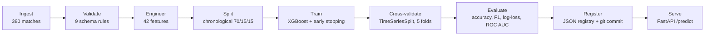
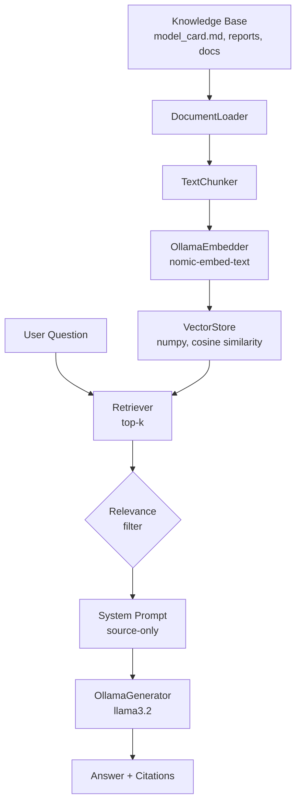

# Project Showcase — Football Intelligence Platform

A complete technical write-up of the platform's design, engineering decisions, and outcomes.

---

## Executive Summary

The Football Intelligence Platform is an end-to-end AI system: it ingests raw football match data, engineers 42 leakage-safe predictive features, trains and evaluates an XGBoost classifier, explains every prediction with SHAP, serves all of this through a FastAPI backend, grounds a local LLM assistant in the platform's own data via RAG, and exposes the whole thing through a native Android app built with Compose Multiplatform.

It was built across 12 sequential stages by a single engineer, with architecture frozen early and revisited only through ADRs. The result: 462 passing tests, sub-10ms prediction and explanation latency, zero cloud dependency, and a documented, reproducible pipeline that runs end-to-end from one CLI command.

This document explains *why* each major component exists and the trade-offs behind it — not just what was built.

---

## Problem Statement

Football match prediction is a well-trodden ML demo (it's tabular, well-understood, and has clean public data). That made it a good *vehicle*, but the real problem this project set out to solve was different:

> **Most ML demos stop at "the model is 56% accurate." This project asks: what's required to make that prediction trustworthy, explainable, queryable in natural language, and usable from a real mobile client — all running locally, with no cloud bill?**

That reframing drove every architectural decision: explainability isn't a notebook plot, it's an API contract. Grounding isn't a nice-to-have, it's enforced by the system prompt and tested. The Android app isn't a UI shell over fake data — it talks to the real backend running the real model.

---

## Architecture Overview

The system is layered top to bottom, with one-directional dependencies (Clean Architecture):

```mermaid
flowchart TD
    subgraph Mobile["Android (Compose Multiplatform)"]
        UI[Composables] --> VM[ViewModels — StateFlow]
        VM --> Repo[Repositories]
        Repo --> Ktor[Ktor HTTP Client]
    end

    Ktor -- HTTPS/JSON --> API

    subgraph Backend["FastAPI Backend"]
        API[Routers] --> Svc[Services]
        Svc --> Pred[PredictionService]
        Svc --> Expl[ExplanationService]
        Svc --> Chat[ChatService]
    end

    Pred --> Model[XGBoost Model\nmodels/latest/model.joblib]
    Expl --> Model
    Chat --> RAG[RAG Pipeline\nOllama + VectorStore]

    Model -. produced by .-> Pipeline[AI Training Pipeline]
    RAG -. grounded in .-> KB[Knowledge Base\nmodel cards, docs]
```

Each layer can be tested in isolation: the AI pipeline has no FastAPI dependency; the backend has no Android dependency; the Android app talks only through `FootballApiService`, an interface that is fully mockable.

---

## Design Decisions

Four decisions were significant enough to warrant ADRs (full text in [`docs/adr/`](../adr/)):

| Decision | Why | ADR |
|---|---|---|
| XGBoost over logistic regression / neural nets | Tabular data, strong baseline, native SHAP support via `TreeExplainer`, fast to train and serve | [001](../adr/001-use-xgboost-for-predictions.md) |
| joblib over pickle/ONNX for model serialisation | Native scikit-learn ecosystem support, simpler than ONNX for a single-model project, safer than raw pickle for internal artifacts | [002](../adr/002-joblib-model-serialization.md) |
| Chronological split, not random | Match data is time-ordered; a random split leaks future information into past predictions via rolling-window features | [003](../adr/003-chronological-train-val-test-split.md) |
| SHAP `TreeExplainer` over LIME / Captum / native importance | Exact (not approximate) attribution for tree ensembles, fast enough for per-request use, multi-class native support | [004](../adr/004-shap-for-explainability.md) |

Decisions made without a formal ADR (didn't meet the bar — no new ML model, dependency, schema, or API contract change) but worth noting:

- **Ollama over a hosted LLM API.** Keeps the entire system runnable offline with zero API cost and zero data leaving the machine — directly supporting the project's "no cloud dependency" goal.
- **numpy vector store over a managed vector DB.** At a few hundred document chunks, brute-force cosine similarity in numpy is faster to build, debug, and deploy than standing up Pinecone/Weaviate/pgvector for a dataset this size.
- **Koin over Hilt/Dagger.** Compose Multiplatform's KMP target needs DI that works outside the Android annotation-processor toolchain; Koin's `module {}` DSL is multiplatform-native.

---

## AI Engineering Highlights

- **Leakage-safe feature engineering.** All 9 rolling-window feature generators apply `.shift(1)` before computing form/Elo/goal statistics, so a match's features only ever see *prior* matches. Verified by dedicated leakage tests in `ai/tests/feature_engineering/`.
- **Deterministic, dependency-ordered features.** The `FeatureRegistry` uses Kahn's topological sort so that features depending on other features (e.g. Elo-adjusted form) are always computed in the correct order, regardless of registration order.
- **Per-prediction, not just global, explainability.** `POST /explain` returns SHAP attribution for the *specific* match requested — top positive features, top negative features, and the full 42-feature breakdown — not a static global importance chart.
- **Grounded-by-construction assistant.** The system prompt instructs the LLM to answer only from retrieved context; low-relevance retrieved chunks are filtered before they ever reach the prompt. The result is tested for graceful degradation (`503`, not hallucination) when Ollama is offline.
- **Reproducible pipeline, not a notebook.** `ingest → feature_engineering → training → explainability` is four CLI commands, fully scripted, idempotent, under 15 seconds total on the 380-match dataset.

---

## Machine Learning Lifecycle

**Result:** 56.1% test accuracy on a 3-class problem (33.3% random baseline), 0.625 ROC AUC (one-vs-rest). Every run is versioned in `models/registry.json` with the producing git commit, dataset version, and framework versions — so any prediction can be traced back to the exact code and data that produced its model.

---

## Model Explainability

SHAP's `TreeExplainer` computes exact Shapley values for tree ensembles — not the sampling-based approximation LIME uses. For a 3-class XGBoost model this means a `(n_samples, n_features, n_classes)` SHAP tensor, normalised and cached per model version (`ExplainerCache`) so the explainer isn't rebuilt on every request.

`POST /explain` returns:
- `top_positive_features` — features that pushed the prediction toward the predicted outcome
- `top_negative_features` — features that pushed against it
- `all_contributions` — the full 42-feature breakdown

This is surfaced directly in the Android **Explain Prediction** screen — explainability is a user-facing feature, not a data-scientist-only artifact.

---

## Retrieval-Augmented Generation

The assistant cannot answer from parametric knowledge alone — the system prompt explicitly constrains it to retrieved context, and low-relevance chunks are dropped before generation. If the retrieval index returns nothing useful, the model is expected to say so rather than fabricate an answer. This is a deliberate trade-off: smaller, more constrained answers over fluent but ungrounded ones.

---

## Backend Design

FastAPI was chosen for native async support, automatic OpenAPI generation, and first-class Pydantic v2 integration. Key patterns:

- **Lifespan-based DI.** All AI services (`PredictionService`, `ExplanationService`, `ChatService`) load once at startup into `app.state` — no per-request model reloading, no global mutable singletons accessed ad hoc.
- **Structured exception handling.** Domain exceptions (`ModelNotAvailableError`, `FeatureMissingError`, `AssistantNotAvailableError`) map to specific HTTP status codes (503, 422, 503) via dedicated exception handlers — callers always get structured JSON, never a raw traceback.
- **Graceful degradation.** If the model artifact is missing, `/health` still returns 200 (with `model_loaded: false`); only the endpoints that need the model return 503. The system never crashes due to a missing optional dependency.

---

## Android Design

Compose Multiplatform was chosen to keep the UI layer (Composables, theme, navigation contracts) shareable across potential future targets, while ViewModels stay Android-specific (`androidMain`) to use `androidx.lifecycle.ViewModel` and `viewModelScope`.

- **MVVM with `StateFlow`.** Every screen has a sealed `UiState` (`Loading` / `Success` / `Error`); Composables are pure functions of that state plus event callbacks — no business logic in the UI layer.
- **Repository pattern.** `FootballApiService` is the only thing that knows about Ktor; repositories wrap it and return `NetworkResult<T>`, which ViewModels translate into UI state.
- **ViewModel sharing across a flow.** Prediction → Result → Explain share a single `PredictionViewModel` via `navController.getBackStackEntry(Screen.Prediction.route)`, so the same prediction request doesn't have to be re-issued at each step.
- **Koin DI.** Each feature module owns its own DI module (`HomeModule`, `PredictionModule`, etc.), assembled once in `FootballApplication`.

---

## Testing Strategy

| Layer | Approach | Count |
|---|---|---|
| AI/data pipeline | Unit tests per package, mirroring source structure | ~300 |
| Backend API | `TestClient` with mocked AI services for contract tests | 43 |
| Backend integration | `TestClient` with the **real** trained model — no mocks | 36 |
| Android repositories | MockK-based unit tests against `FootballApiService` | 9 |
| **Total** | | **462 backend/AI + 9 Android = 471** |

The integration suite (Stage 12) deliberately avoids mocking the model — it asserts on real SHAP values being finite, real probabilities summing to 1.0, and real latency staying under threshold. This catches classes of bugs (numerical issues, serialization mismatches, performance regressions) that contract tests with mocks cannot.

---

## CI/CD

GitHub Actions runs on every push and pull request:

- `ruff check` — linting
- `black --check` — formatting
- `mypy` — strict type checking
- `pytest` — full test suite (462 tests)

The pipeline fails fast on any of these; no merge proceeds with a red check.

---

## Documentation Strategy

Documentation is treated as a deliverable, not an afterthought:

- **ADRs** for every structural decision (`docs/adr/`), never deleted — superseded decisions are marked Deprecated, not removed.
- **A stage report for every build stage** (`docs/reports/stage-NN-summary.md`) — what was built, what was tested, what's known to be incomplete.
- **A demo script for every stage** (`docs/demo/stage-NN-demo.md`) — step-by-step manual verification, runnable by anyone, not just the author.
- **Release notes** (`docs/releases/`) summarising each tagged version's highlights, known limitations, and roadmap.

This showcase document set (`docs/showcase/`) is the final layer: written for an audience that wasn't present for the 12 build stages.

---

## Release Strategy

Semantic versioning, three releases to date:

| Version | Focus |
|---|---|
| v0.1.0 | Data pipeline, feature engineering, XGBoost training |
| v0.2.0 | SHAP explainability, FastAPI backend, RAG assistant |
| v1.0.0 | Android app, end-to-end integration tests, production readiness |

Each release follows the same gate: full test suite green, all quality checks clean, release notes written, before the version is tagged.

---

## Lessons Learned

- **Time-series leakage is subtle and easy to introduce accidentally.** Rolling-form and Elo features computed without `.shift(1)` look correct in a quick sanity check but silently leak future match outcomes into training data — caught via chronological-split validation, formalised in [ADR 003](../adr/003-chronological-train-val-test-split.md).
- **Explainability as an API contract forces better engineering than explainability as a notebook plot.** Building `POST /explain` to be fast and deterministic (via `ExplainerCache`) was a direct consequence of treating it as a product feature with a latency budget, not a one-off analysis script.
- **A small grounded model beats a large ungrounded one for factual QA.** `llama3.2` with strict source-only prompting and relevance-filtered retrieval was more trustworthy in practice than giving the model more freedom.
- **Module boundaries in KMP pay off immediately, not just eventually.** Splitting `core-network` / `core-model` from feature modules made Ktor repository tests possible without any Android instrumentation — fast, deterministic, CI-friendly.
- **Mocked tests and integration tests catch different bug classes.** The 426 unit tests (mocked services) validate API contracts; the 36 integration tests (real model) validate numerical correctness and latency. Both are necessary; neither is sufficient alone.

---

## Future Scope

Explicitly out of scope for this project (see root [README — Future Improvements](../../README.md#future-improvements-out-of-scope) for the full list):

- Multi-season data with persistent cross-season Elo ratings.
- Hyperparameter optimisation (Optuna or similar).
- Structured RAG faithfulness evaluation against a ground-truth Q&A benchmark.
- On-device feature computation in the Android app (currently uses neutral demo values).
- Authentication, rate limiting, and other production-deployment hardening.
- Fine-tuning or LoRA training of any language model — a deliberate philosophical choice, not a gap.
