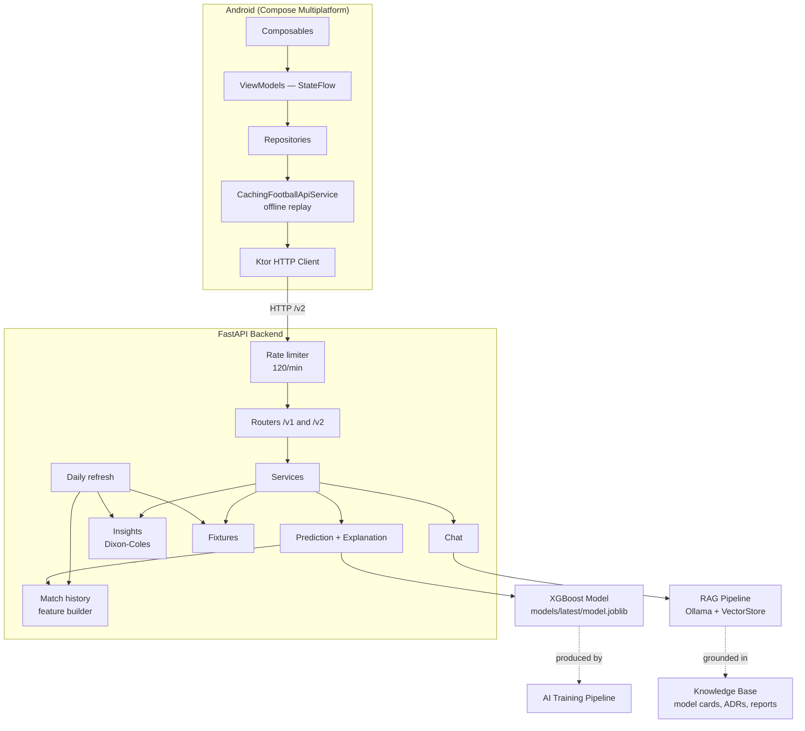
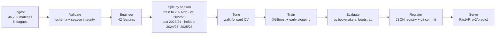
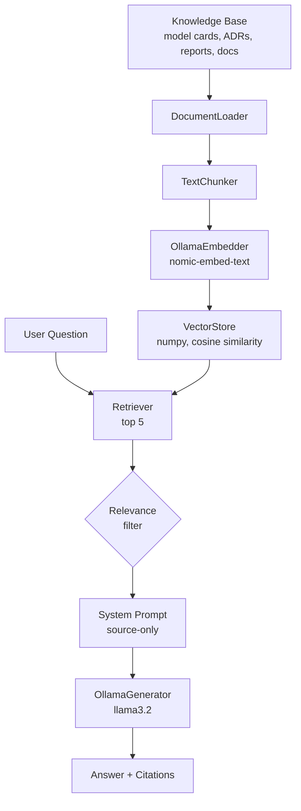

# Project Showcase — Football Intelligence Platform

A complete technical write-up of the platform's design, engineering decisions, and outcomes, as of release v2.0.1.

---

## Executive Summary

The Football Intelligence Platform is an end-to-end AI system for Europe's top five football leagues. It ingests 26 seasons of match results (46,709 matches), engineers 42 leakage-safe pre-match features, trains and evaluates an XGBoost classifier, and explains every prediction with SHAP in plain football language. A Dixon-Coles goals model adds likely scorelines and goal markets. A versioned FastAPI backend serves all of this, refreshes its data daily without a restart, and rate limits clients. A local LLM assistant is grounded in the platform's own documents via RAG. A native Android app built with Compose Multiplatform opens on upcoming fixtures and keeps working offline.

It was built in 12 stages up to release v1.0.0, then extended in v2.0.0, v2.0.1 and v2.1.0, by a single engineer, with every structural change recorded as an ADR. The result: 871 passing tests (798 Python, 73 Android), 16 ADRs, zero cloud dependency, and a reproducible pipeline. On the 2023/24 test season the model reaches 52.5% accuracy and a log loss of 0.976, against 55.0% and 0.955 for bookmakers.

This document explains *why* each major component exists and the trade-offs behind it — not just what was built.

---

## Problem Statement

Football match prediction is a well-trodden ML demo (it's tabular, well-understood, and has clean public data). That made it a good *vehicle*, but the real problem this project set out to solve was different:

> **Most ML demos stop at "the model is X% accurate." This project asks: what's required to make that prediction trustworthy, explainable, queryable in natural language, and usable from a real mobile client — all running locally, with no cloud bill?**

That reframing drove every architectural decision: explainability isn't a notebook plot, it's an API contract. Evaluation isn't one number, it's a benchmark against bookmakers with confidence intervals. Grounding isn't a nice-to-have, it's enforced by the system prompt. The Android app isn't a UI shell over fake data — it talks to the real backend running the real model.

---

## Architecture Overview

The system is layered top to bottom, with one-directional dependencies (Clean Architecture):

```mermaid
flowchart TD
    subgraph Mobile["Android (Compose Multiplatform)"]
        UI[Composables] --> VM[ViewModels — StateFlow]
        VM --> Repo[Repositories]
        Repo --> Cache[CachingFootballApiService\noffline replay]
        Cache --> Ktor[Ktor HTTP Client]
    end

    Ktor -- "HTTP /v2" --> RL

    subgraph Backend["FastAPI Backend"]
        RL[Rate limiter\n120/min] --> API[Routers /v1 and /v2]
        API --> Svc[Services]
        Svc --> Pred[Prediction + Explanation]
        Svc --> Ins[Insights\nDixon-Coles]
        Svc --> Fix[Fixtures]
        Svc --> Chat[Chat]
        Refresh[Daily refresh] --> Hist[Match history\nfeature builder]
        Refresh --> Ins
        Refresh --> Fix
        Pred --> Hist
    end

    Pred --> Model[XGBoost Model\nmodels/latest/model.joblib]
    Chat --> RAG[RAG Pipeline\nOllama + VectorStore]

    Model -. produced by .-> Pipeline[AI Training Pipeline]
    RAG -. grounded in .-> KB[Knowledge Base\nmodel cards, ADRs, reports]
```

Each layer can be tested in isolation: the AI pipeline has no FastAPI dependency; the backend has no Android dependency; the Android app talks only through `FootballApiService`, an interface that is fully mockable.

---

## Design Decisions

Every structural decision has an ADR (full text and index in [`docs/adr/`](../adr/)). The most important:

| Decision | Why | ADR |
|---|---|---|
| XGBoost over logistic regression / neural nets | Tabular data, strong baseline, native SHAP support via `TreeExplainer`, fast to train and serve | [001](../adr/001-use-xgboost-for-predictions.md) |
| SHAP `TreeExplainer` over LIME / native importance | Exact attribution for tree ensembles, fast enough per request, multi-class native | [004](../adr/004-shap-for-explainability.md) |
| Top five leagues, 26 seasons of data | One season was too little data; more data helped far more than tuning | [005](../adr/005-top-five-leagues-multi-source-data.md) |
| Season-based split with holdout seasons | A random split leaks the future through rolling features; whole seasons copy real use | [007](../adr/007-season-based-split-and-evaluation.md) |
| Features computed on the server | One code path for training and serving, so no training/serving skew | [008](../adr/008-server-side-match-features.md) |
| Dixon-Coles goals model for scores | A standard, explainable goals model that gives a full score grid | [009](../adr/009-dixon-coles-goals-model.md) |
| "Draw possible" tag instead of draw picks | Draw probabilities are calibrated but flat; forcing draws costs 4–5 accuracy points | [011](../adr/011-draw-possible-tag.md) |
| Daily refresh inside the backend | Fresh data without a restart or an extra scheduler | [013](../adr/013-daily-data-refresh-in-backend.md) |
| Path-versioned API and a rate limiter | v1.0.0 clients keep their contract; one client can't monopolise the model | [014](../adr/014-api-versioning-and-rate-limiting.md) |
| Fixtures from openfootball | Full season schedules; football-data's fixtures file covers only a few days | [015](../adr/015-upcoming-fixtures-from-openfootball.md) |

Decisions made without a formal ADR but worth noting:

- **Ollama over a hosted LLM API.** Keeps the entire system runnable offline with zero API cost and zero data leaving the machine.
- **numpy vector store over a managed vector DB.** At a few hundred document chunks, exact cosine similarity in numpy is faster to build, debug, and deploy than a vector database.
- **Koin over Hilt/Dagger.** Compose Multiplatform's KMP target needs DI that works outside the Android annotation-processor toolchain.

---

## AI Engineering Highlights

- **Leakage-safe feature engineering.** All 9 feature generators use only prior matches (`.shift(1)` before rolling windows), and data is split by whole seasons. Verified by dedicated leakage tests.
- **Deterministic, dependency-ordered features.** The `FeatureRegistry` uses Kahn's topological sort so that features depending on other features (e.g. strength of schedule on Elo) are always computed in the correct order.
- **Honest evaluation.** Hyperparameters are tuned by season walk-forward cross-validation on training seasons only. Every candidate is compared with the current model and with bookmaker odds on the same matches, and promoted only if a paired bootstrap interval excludes zero.
- **Training/serving parity.** The server builds all 42 features from match history with the training pipeline itself; clients send only team names.
- **Per-prediction explainability in plain language.** `POST /v2/explain` returns SHAP attribution for the specific match, with a fan-friendly label and value for every feature ("Arsenal win rate at home · 68%").
- **Grounded-by-construction assistant.** The system prompt restricts the LLM to retrieved context, requires citations and a fixed "not enough information" reply, and the backend returns `503`, not a hallucination, when Ollama is offline.
- **Reproducible pipeline, not a notebook.** Backfill, features, training and explainability are scripted CLI commands (see the root README's Quick Start); every dataset and model is versioned.

---

## Machine Learning Lifecycle

```mermaid
flowchart LR
    A[Ingest\n46,709 matches\n5 leagues] --> B[Validate\nschema + season integrity]
    B --> C[Engineer\n42 features]
    C --> D[Split by season\ntrain to 2021/22 · val 2022/23\ntest 2023/24 · holdout 2024/25–2025/26]
    D --> E[Tune\nwalk-forward CV]
    E --> F[Train\nXGBoost + early stopping]
    F --> G[Evaluate\nvs bookmakers, bootstrap]
    G --> H[Register\nJSON registry + git commit]
    H --> I[Serve\nFastAPI /v2/predict]
```

**Result:** 52.5% test accuracy on a 3-class problem (33.3% random baseline, 55.0% bookmakers), log loss 0.976 (bookmakers 0.955), ROC AUC 0.679. On 250 real 2026/27 matches up to 20 September 2026 the model scored 52.4%, against 51.6% for bookmaker favourites. Every run is versioned in the registry with its git commit and dataset version, so any prediction can be traced back to the code and data that produced its model.

---

## Model Explainability

SHAP's `TreeExplainer` computes exact Shapley values for tree ensembles — not the sampling-based approximation LIME uses. The explainer is cached per model version (`ExplainerCache`) so it isn't rebuilt on every request.

`POST /v2/explain` returns:
- `top_positive_features` — features that pushed the prediction toward the predicted outcome
- `top_negative_features` — features that pushed against it
- `all_contributions` — the full 42-feature breakdown

Each item carries `display_name` and `display_value`, so the Android **Explain** screen can show "Why the model leans this way" and "What counts against it" in plain language, with Big, Medium or Small impact instead of raw numbers.

---

## Scoreline Predictions

A time-weighted Dixon-Coles model per league (`POST /v2/insights`) estimates attack and defence strengths and turns them into a full score grid: the five most likely scores, expected goals, both teams to score, over/under lines and clean sheets. It is refitted at startup and after every daily refresh. Its most likely score is right 12–14% of the time, and its goal totals are well calibrated (2.81 forecast against 2.80 actual per match). XGBoost keeps the headline pick because its home/draw/away probabilities are better ([report](../reports/goals-model.md)).

---

## Retrieval-Augmented Generation

```mermaid
flowchart TD
    A[Knowledge Base\nmodel cards, ADRs, reports, docs] --> B[DocumentLoader]
    B --> C[TextChunker]
    C --> D[OllamaEmbedder\nnomic-embed-text]
    D --> E[VectorStore\nnumpy, cosine similarity]
    Q[User Question] --> F[Retriever\ntop 5]
    E --> F
    F --> G{Relevance\nfilter}
    G --> H[System Prompt\nsource-only]
    H --> I[OllamaGenerator\nllama3.2]
    I --> J[Answer + Citations]
```

The assistant cannot answer from parametric knowledge alone — the system prompt constrains it to retrieved context, and if nothing relevant is retrieved it must say so. This is a deliberate trade-off: smaller, more constrained answers over fluent but ungrounded ones.

---

## Backend Design

FastAPI was chosen for native async support, automatic OpenAPI generation, and first-class Pydantic v2 integration. Key patterns:

- **Lifespan-based DI.** Both models, match history, goals models, fixtures and the assistant load once at startup into `app.state` — no per-request model reloading.
- **API versions.** `/v2` is current. `/v1` and the unversioned paths keep the v1.0.0 contract with the original Premier League model, so older clients keep working.
- **Rate limiting.** A sliding one-minute window per client (120 requests by default) answers 429 with `Retry-After`.
- **Structured exception handling.** Domain exceptions map to specific status codes: unknown team, unknown competition or missing features (422); model, match history, insights, fixtures or assistant not available (503); unexpected errors (500, logged). Callers always get `{"error", "detail"}` JSON, never a traceback.
- **Graceful degradation.** Each part loads independently. If one is missing, `/health` still returns 200 and reports it; only the endpoints that need it return 503. A failed daily refresh keeps serving the old data.

---

## Android Design

Compose Multiplatform keeps the UI layer (Composables, theme, navigation contracts) shareable, while ViewModels stay Android-specific (`androidMain`) to use `androidx.lifecycle.ViewModel` and `viewModelScope`.

- **Screens.** The app opens on upcoming fixtures by date, with one tab per league. A bottom bar leads to Fixtures, Predict, Assistant and Settings. Predict starts with a league picker; the result shows probabilities, a "draw possible" tag and likely scores; Explain shows plain-language factors; Settings holds the backend status card.
- **MVVM with `StateFlow`.** Every screen has a sealed `UiState` (`Loading` / `Success` / `Error`); Composables are pure functions of that state plus event callbacks.
- **Repository pattern.** `FootballApiService` is the only thing that knows about Ktor; repositories wrap it and return `NetworkResult<T>`.
- **Offline first.** `CachingFootballApiService` saves every successful response and replays it only when the server can't be reached, under an offline banner with the save time. Every data screen supports pull to refresh.
- **ViewModel sharing across a flow.** Prediction → Result → Explain share a single `PredictionViewModel` via `navController.getBackStackEntry(Screen.Prediction.route)`.
- **Koin DI.** Each feature module owns its DI module, assembled once in `FootballApplication`.

---

## Testing Strategy

| Layer | Approach | Count |
|---|---|---|
| AI, data pipeline and backend | Unit and API contract tests (`TestClient` with mocked AI services) | 762 |
| Backend integration | `TestClient` with the **real** trained model — no mocks | 36 |
| Android | ViewModels (test-first), repositories with Ktor `MockEngine`, cache, formatting | 66 |
| **Total** | | **871** |

The integration suite deliberately avoids mocking the model — it asserts on real SHAP values being finite, real probabilities summing to 1.0, and latency staying under threshold. This catches bugs (numerical issues, serialization mismatches, performance regressions) that contract tests with mocks cannot.

---

## CI/CD

GitHub Actions runs on every pull request into main and every push to main:

- Python: `ruff check`, `black --check`, `mypy`, `pytest`
- Android: `assembleDebug`, unit tests, Detekt and Spotless
- Repository checks (structure, markdown) and a GitGuardian secret scan

No merge proceeds with a red check.

---

## Documentation Strategy

Documentation is treated as a deliverable, not an afterthought:

- **ADRs** for every structural decision (`docs/adr/`), never deleted — superseded decisions are marked, not removed.
- **A stage report for every build stage** (`docs/reports/stage-NN-summary.md`), plus experiment reports (draws, goals model, Kaggle extras, in-season accuracy).
- **A demo script for every stage** (`docs/demo/stage-NN-demo.md`).
- **Release notes** (`docs/releases/`) for each tagged version.
- **A 3-minute narrated demo video** ([`docs/showcase/demo-video/`](demo-video/README.md)).

This showcase document set (`docs/showcase/`) is written for an audience that wasn't present for the build.

---

## Release Strategy

Semantic versioning, six releases to date:

| Version | Focus |
|---|---|
| v0.1.0 | Data pipeline, feature engineering, XGBoost training |
| v0.2.0 | SHAP explainability, FastAPI backend, RAG assistant |
| v1.0.0 | Android app, end-to-end integration tests, production readiness |
| v2.0.0 | Five leagues, versioned API, fixtures, goals model, offline app, daily refresh |
| v2.0.1 | Offline fallback within seconds, demo video |
| v2.1.0 | App icon, Kick-off launch screen and loader, develop and main branch flow |

Each release follows the same gate: full test suite green, all quality checks clean, release notes written, before the version is tagged.

---

## Lessons Learned

- **Data beats tuning.** Moving from one season to 26 seasons across five leagues improved log loss far more than any hyperparameter change.
- **Time-series leakage is subtle.** Rolling features without `.shift(1)`, or a random split, silently leak future outcomes. Whole-season splits and leakage tests made the results trustworthy ([ADR 007](../adr/007-season-based-split-and-evaluation.md)).
- **Benchmarks keep you honest.** Comparing with bookmaker odds and requiring a bootstrap interval that excludes zero stopped several appealing features (draw features, xG, FIFA ratings) from shipping without evidence.
- **Explainability as an API contract forces better engineering.** Building `/explain` for users meant caching, fan-friendly labels and a test that every feature has one.
- **Training/serving parity matters more than model choice.** Version one's app sent placeholder features; moving feature computation to the server fixed predictions more than any model change.

---

## Future Scope

Not built yet, and each a deliberate scope decision:

- Structured RAG evaluation (retrieval hit rate, faithfulness, refusals) against a ground-truth question set.
- Player-level data (lineups, injuries) from a reliable source.
- Automated monitoring of live accuracy and calibration, with drift alerts.
- Authentication and HTTPS for public deployment; a shared rate-limit store behind a load balancer.
- Automatic retries with backoff for downloads and LLM calls.
- Fine-tuning or LoRA training of any language model stays out of scope — a deliberate choice, not a gap.
